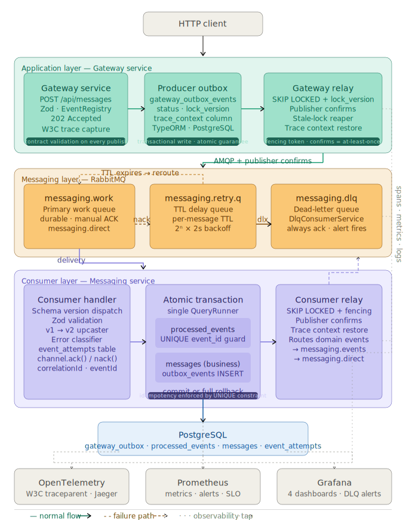
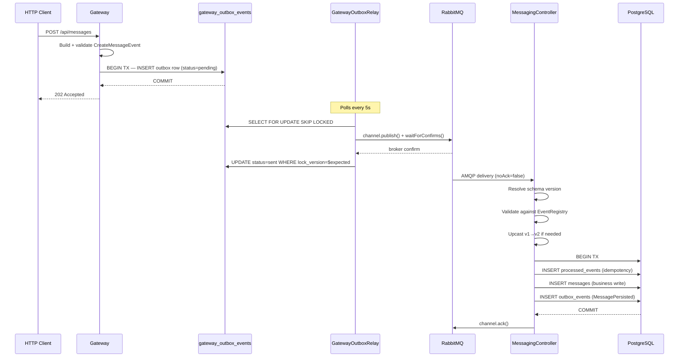
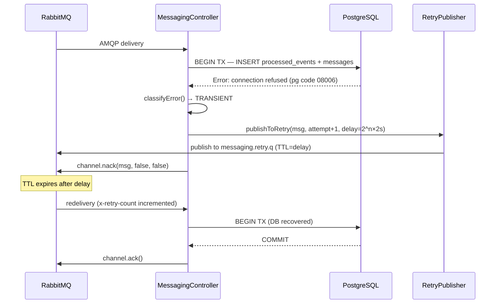
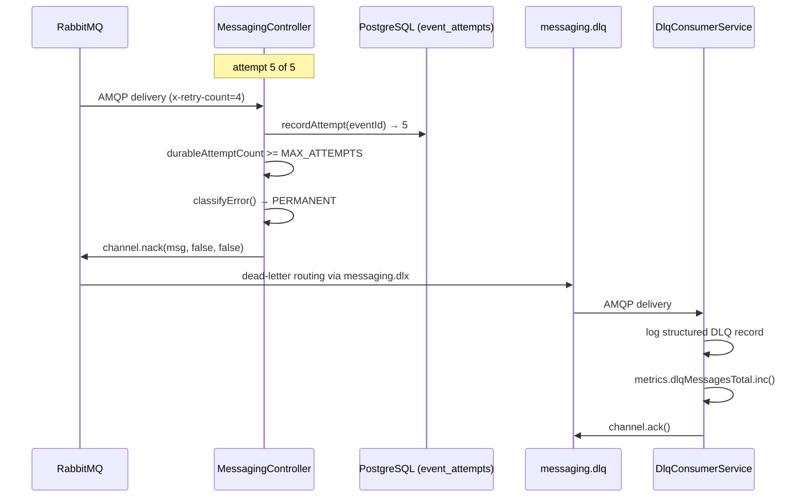
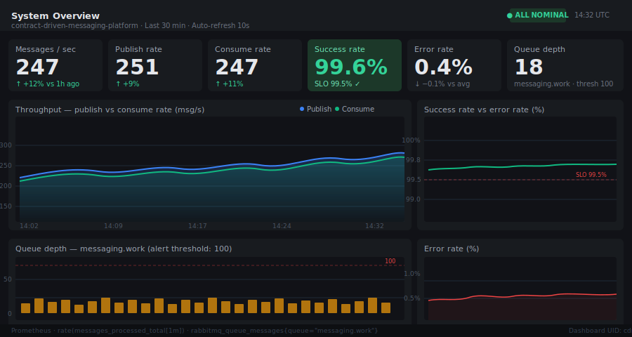
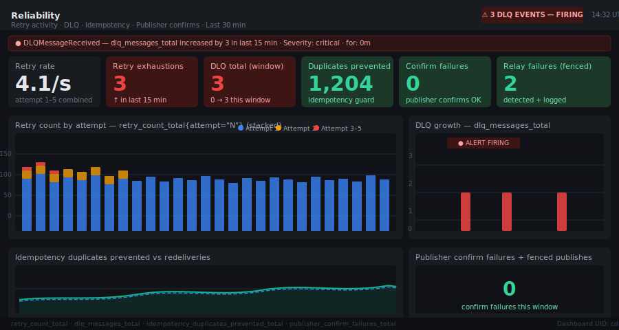
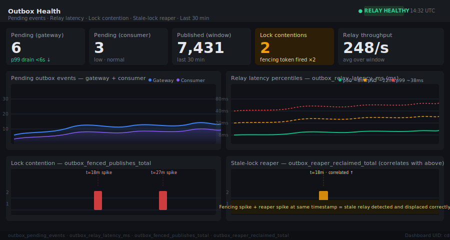
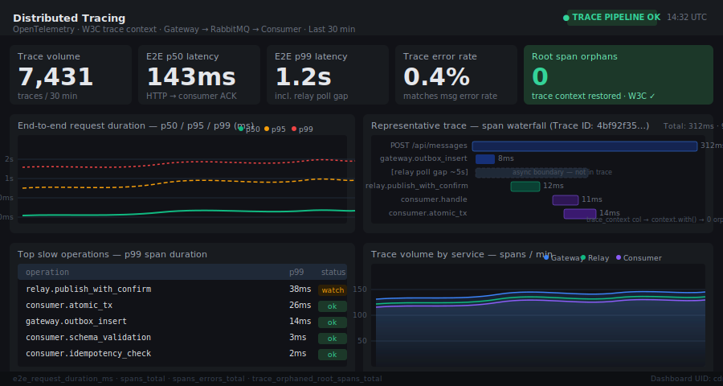

# Contract-Driven Messaging Platform



---

## About This Repository

This repository contains the **messaging infrastructure layer** of a production-oriented modular ERP system. It exists as a standalone public project to demonstrate the distributed systems engineering behind that platform — not to expose the business logic that runs on top of it.

The ERP itself is a private monorepo containing business modules: Inventory, Accounting, CRM, HR, Purchasing, Sales, Workflow, and their internal domain logic. Those modules remain private. This repository isolates and documents only the infrastructure decisions that are not domain-specific: how events flow reliably between services, how contracts are enforced across async boundaries, and how the system behaves when dependencies fail.

**Why this scope?** The engineering problems in this repository — schema drift, lost events, duplicate processing, retry storms, distributed tracing across async boundaries — are not specific to any ERP domain. They are general distributed systems problems. Extracting them into a standalone project makes them legible and verifiable without exposing proprietary business logic.

**What is demonstrated here:**

- Event-Driven Architecture over RabbitMQ with explicit topology management
- Reliability Engineering: transactional outbox, idempotent consumer, publisher confirms, fencing tokens
- Schema-versioned contracts with backward-compatible evolution and upcasting
- Distributed tracing across async boundaries using W3C trace context
- Production observability: OpenTelemetry, Prometheus, four Grafana dashboards
- Architecture Decision Records documenting non-obvious choices and their tradeoffs
- Operational runbooks and blameless postmortems as first-class engineering artifacts
- A performance testing suite with capacity analysis

**What is intentionally omitted:**

- ERP business modules (Inventory, Accounting, CRM, HR, Purchasing, Sales, Workflow)
- Domain entities, business rules, and application-layer logic
- Authentication, multi-tenancy, and customer-facing APIs
- Deployment manifests and production infrastructure configuration

The omissions are not gaps — they are the private ERP's concern. This repository documents the layer underneath.

---

## System Context

The diagram below shows where this repository sits in relation to the full ERP platform.

```
┌─────────────────────────────────────────────────────────────────┐
│  ERP Platform                                            PRIVATE │
│                                                                  │
│  ┌──────────────────────────────────────────────────────────┐   │
│  │  Business Modules                                        │   │
│  │  Inventory · Accounting · CRM · HR · Purchasing · Sales  │   │
│  │  Workflow · Internal APIs · Domain Logic                 │   │
│  └─────────────────────┬────────────────────────────────────┘   │
│                         │ events                                 │
│  ┌──────────────────────▼────────────────────────────────────┐  │
│  │  Infrastructure Layer                             PUBLIC   │  │
│  │                                                           │  │
│  │  ┌──────────────┐      ┌───────────────────────────────┐  │  │
│  │  │   Gateway    │─────▶│  Transactional Outbox         │  │  │
│  │  │  Service     │      │  (gateway_outbox_events)      │  │  │
│  │  └──────────────┘      └──────────────┬────────────────┘  │  │
│  │                                        │ relay + confirms  │  │
│  │  ┌─────────────────────────────────────▼──────────────┐   │  │
│  │  │  RabbitMQ Topology                                 │   │  │
│  │  │  messaging.direct · messaging.dlx · retry.q · dlq  │   │  │
│  │  └─────────────────────┬──────────────────────────────┘   │  │
│  │                         │ manual ACK                       │  │
│  │  ┌──────────────────────▼────────────────────────────────┐│  │
│  │  │  Messaging Service                                    ││  │
│  │  │  Validate · Upcast · Idempotency · Business Write    ││  │
│  │  │  Outbox (outbox_events) · DLQ Consumer               ││  │
│  │  └───────────────────────────────────────────────────────┘│  │
│  │                                                            │  │
│  │  Observability: OpenTelemetry · Prometheus · Grafana · Pino│  │
│  └────────────────────────────────────────────────────────────┘  │
└─────────────────────────────────────────────────────────────────┘
```

**PRIVATE** — Business modules, domain logic, ERP application layer  
**PUBLIC** — This repository: messaging infrastructure, reliability layer, observability

The infrastructure layer is domain-agnostic. It accepts typed events from the Gateway and delivers them reliably to downstream services. It knows nothing about inventory quantities, accounting entries, or HR workflows — those concerns belong to the modules that publish and consume events.

---

## TL;DR

[](https://github.com/mostafaramzanian/contract-driven-messaging-platform/actions/workflows/ci.yml)


A two-service NestJS monorepo demonstrating production-grade event-driven architecture with verifiable reliability guarantees. Built to address the failure modes that emerge when distributed systems rely on implicit message contracts and unguarded delivery semantics.

**Stack:** NestJS · RabbitMQ · PostgreSQL · TypeORM · Zod · OpenTelemetry · Prometheus · Docker Compose

**Architecture:** HTTP Gateway writes events to a transactional outbox. A relay polls and publishes to RabbitMQ with publisher confirms. A Messaging Service consumes with manual ACK, validates against versioned Zod contracts, and writes business state inside an atomic transaction that also commits the idempotency record and a downstream domain event outbox.

**Reliability guarantees:**
- At-least-once delivery via transactional outbox on both producer and consumer sides
- Idempotent consumption enforced by a UNIQUE constraint atomic with the business write
- Fencing token (`lock_version`) closes the double-publish race left open by `SKIP LOCKED` alone
- Durable retry budget (`event_attempts` table) survives manual DLQ requeue and operator replay
- Exponential backoff with per-message TTL; three-tier error classification prevents poison-message loops

**Patterns implemented:** Transactional Outbox · Idempotent Consumer · Dead-Letter Exchange · Schema-Versioned Contracts · Upcaster · W3C Trace Context propagation across async boundaries · Publisher Confirms · Stale-Lock Reaper

**What it demonstrates:** Designing for failure, not around it — each reliability mechanism exists to close a specific, named failure mode, documented in code and verified by a dedicated reliability test suite (12 scenarios, 206 tests).

---

## Table of Contents

- [About This Repository](#about-this-repository)
- [System Context](#system-context)
- [TL;DR](#tldr)
- [Repository Tour](#repository-tour)
- [Architecture Overview](#architecture-overview)
- [Reliability Guarantees](#reliability-guarantees)
- [Observability](#observability)
- [Tradeoffs and Limitations](#tradeoffs-and-limitations)
- [Lessons Learned](#lessons-learned)
- [Operational Runbooks](#operational-runbooks)
- [Performance Testing & Capacity Planning](#performance-testing--capacity-planning)
- [Incident Postmortems](#incident-postmortems)
- [Quick Start](#quick-start)

<details>
<summary>Full section index</summary>

- [Problems This Repository Solves](#problems-this-repository-solves)
- [Architecture Decision Records](#architecture-decision-records)
- [Event Contracts](#event-contracts)
- [Message Lifecycle](#message-lifecycle)
- [Failure Scenarios and Recovery](#failure-scenarios-and-recovery)
- [Testing Strategy](#testing-strategy)
- [Scalability Characteristics](#scalability-characteristics)
- [Security Considerations](#security-considerations)
- [Interview Discussion Topics](#interview-discussion-topics)
- [Repository Evolution](docs/evolution.md)
- [Engineering Scope](docs/project-scope.md)
- [Project Structure](#project-structure)

</details>

---

## Repository Tour

The infrastructure layer is designed so that any of its concerns — reliability, observability, contract governance, operational procedures — can be read independently. This table is the entry point.

| If you want to... | Go here | Purpose |
|---|---|---|
| Understand the full system at a glance | [Architecture Overview](#architecture-overview) + [hero diagram](docs/architecture.svg) | Establish the service boundary, data flow, and failure paths before reading any code |
| Understand why this repository exists | [About This Repository](#about-this-repository) + [docs/project-scope.md](docs/project-scope.md) | Clarify what the ERP is, what this layer does, and what is intentionally omitted |
| Verify the reliability claims | [Reliability Guarantees](#reliability-guarantees) | Each guarantee maps to a named mechanism, a test that induces the failure, and the recovery behavior |
| Understand how the RabbitMQ topology is wired | [ADR-001](docs/adr/ADR-001-rabbitmq-vs-kafka.md) + [Failure Scenarios](#failure-scenarios-and-recovery) | Exchange-queue-binding model, DLX routing, per-message TTL backoff |
| Read why each architectural decision was made | [docs/adr/](docs/adr/) | Capture the reasoning, alternatives considered, and tradeoffs — 6 ADRs covering all non-obvious choices |
| Understand every failure mode and its recovery | [Failure Scenarios and Recovery](#failure-scenarios-and-recovery) + [Runbooks](docs/runbooks/) | Map each failure class to what triggers it and how the system recovers with or without operator intervention |
| Read the honest tradeoffs | [Tradeoffs and Limitations](#tradeoffs-and-limitations) | 10 architectural tradeoffs with Context, Benefits, Drawbacks, and Alternatives — no hedging |
| See what was learned from building this | [Lessons Learned](#lessons-learned) + [docs/evolution.md](docs/evolution.md) | 8 retrospective lessons on the decisions that were wrong, and the 10-phase evolution that led to the current design |
| Import production dashboards | [docs/grafana-dashboards.json](docs/grafana-dashboards.json) | 4 pre-built Grafana dashboards covering system overview, reliability, outbox health, and distributed tracing |
| See what every Prometheus metric detects | [Observability → Metrics](#observability) | 15 metrics, each mapped to the specific failure mode it surfaces |
| Respond to a production alert | [docs/runbooks/](docs/runbooks/) | Guide on-call engineers through investigation and recovery with exact SQL and curl commands — 5 runbooks |
| Read real incident analysis | [docs/postmortems/](docs/postmortems/) | Document operational learning from named incidents — 5 blameless postmortems with timeline and follow-up items |
| Understand throughput limits and scaling | [perf/analysis/capacity-model.md](perf/analysis/capacity-model.md) | Component-by-component ceiling calculations with failure-sequence ordering |
| Run the load tests | [perf/k6/scenarios/](perf/k6/scenarios/) | Reproducible k6 scenarios for baseline throughput, saturation, backlog, retry storm, and relay scaling |
| Discuss this in an engineering interview | [Interview Discussion Topics](#interview-discussion-topics) | Topics organized by pattern, with the failure mode each topic is grounded in |

---

## Architecture Overview

The system is organized into six layers. The diagram below shows all service boundaries, event flows, failure paths, and observability taps within the infrastructure layer. Business modules (Inventory, Accounting, CRM, etc.) sit above the Gateway and are not represented here — they interact with the infrastructure layer through the Gateway's HTTP API.

**Layers in this repository:**

| Layer | Components | Responsibility |
|---|---|---|
| Application | Gateway Service, Messaging Service | Accept requests, validate contracts, orchestrate writes |
| Messaging | RabbitMQ topology (exchanges, queues, DLX) | Route events, enforce delivery guarantees, provide DLQ |
| Persistence | PostgreSQL (outbox tables, idempotency, business state) | Atomic writes, durable event log, retry budget |
| Reliability | Outbox relay, fencing tokens, stale-lock reaper, retry publisher | Ensure delivery despite partial failures |
| Observability | OpenTelemetry, Prometheus, Pino | Instrument every layer, propagate context across async boundaries |
| Operations | Runbooks, dashboards, alert rules | Enable on-call response without requiring source-code access |

### Full system diagram (Mermaid)

```mermaid
flowchart TD
    subgraph CLIENT["Client Layer"]
        USER["HTTP Client · POST /api/messages"]
    end

    subgraph GATEWAY["Gateway Layer"]
        direction TB
        GW_VALIDATE["Validate request · Build typed event"]
        GW_CONTRACT["Contract validation · Zod · EventRegistry"]
        GW_TX["BEGIN TRANSACTION"]
        GW_OUTBOX[("gateway_outbox_events · status = pending")]
        GW_RESPONSE["202 Accepted"]
        GW_RELAY["GatewayOutboxRelayService · SKIP LOCKED · lock_version fencing"]
        GW_CONFIRMS["Publisher confirms · channel.waitForConfirms()"]
        GW_MARK["markSent() · CAS on lock_version"]
        GW_TRACE_CAP["Capture trace context · traceparent → trace_context column"]

        GW_VALIDATE --> GW_CONTRACT --> GW_TX --> GW_OUTBOX
        GW_TX --> GW_RESPONSE
        GW_RELAY -->|"polls every 5s"| GW_OUTBOX
        GW_RELAY --> GW_TRACE_CAP
        GW_RELAY --> GW_CONFIRMS --> GW_MARK
    end

    subgraph BROKER["Messaging Infrastructure · RabbitMQ"]
        direction TB
        EX_DIRECT["messaging.direct · direct exchange"]
        EX_EVENTS["messaging.events · fanout exchange"]
        EX_DLX["messaging.dlx · fanout dead-letter exchange"]
        EX_DLQEX["messaging.dlq.exchange · direct"]

        Q_WORK["messaging.work · primary work queue · durable · manual ACK"]
        Q_RETRY["messaging.retry.q · TTL delay queue · per-message TTL: 2ⁿ × 2s"]
        Q_DLQ["messaging.dlq · permanent dead-letter queue"]
        Q_AUDIT["messaging.events.audit · domain event sink"]

        EX_DIRECT --> Q_WORK
        EX_EVENTS --> Q_AUDIT
        Q_WORK -->|"nack or expired"| EX_DLX
        EX_DLX --> Q_RETRY
        Q_RETRY -->|"TTL expires → reroute"| Q_WORK
        EX_DLQEX --> Q_DLQ
    end

    subgraph CONSUMER["Consumer Layer · Messaging Service"]
        direction TB
        C_AMQP["AMQP handler · noAck = false · manual ACK"]
        C_VERSION["resolveSchemaVersion · envelope › header › type suffix › default v1"]
        C_VALIDATE["Zod validation · EventRegistry schema check"]
        C_UPCAST["Upcast v1 → v2 · deterministic · no randomUUID"]
        C_ATTEMPTS["recordAttempt(eventId) · event_attempts table"]
        C_CLASSIFY["classifyError() · VALIDATION · TRANSIENT · PERMANENT"]

        subgraph C_TX["Atomic Transaction · single QueryRunner"]
            C_IDEMP["INSERT processed_events · UNIQUE on event_id · idempotency guard"]
            C_BIZ["INSERT messages · business write"]
            C_OUTBOX_ROW["INSERT outbox_events · MessagePersisted domain event"]
        end

        C_ACK["channel.ack()"]
        C_RETRY_PUB["RetryPublisherService · publish to retry.q · increment x-retry-count"]
        C_NACK_FINAL["channel.nack(false, false) · routes to messaging.dlx"]
        C_RELAY_OUT["OutboxRelayService · SKIP LOCKED · lock_version fencing"]
        C_TRACE_RESTORE["Restore trace context · context.with(extractTraceContext(row))"]
        DLQ_CONSUMER["DlqConsumerService · log + metric · always ack"]

        C_AMQP --> C_VERSION --> C_VALIDATE --> C_UPCAST
        C_UPCAST --> C_ATTEMPTS --> C_CLASSIFY
        C_CLASSIFY -->|"TRANSIENT"| C_RETRY_PUB
        C_CLASSIFY -->|"PERMANENT"| C_NACK_FINAL
        C_CLASSIFY -->|"VALIDATION"| C_ACK
        C_CLASSIFY -->|"success"| C_TX
        C_TX --> C_ACK
        C_RELAY_OUT -->|"polls"| C_OUTBOX_ROW
        C_RELAY_OUT --> C_TRACE_RESTORE
    end

    subgraph PERSISTENCE["Persistence Layer · PostgreSQL"]
        direction LR
        DB_GOB[("gateway_outbox_events")]
        DB_PROC[("processed_events · UNIQUE event_id")]
        DB_MSG[("messages")]
        DB_OB[("outbox_events")]
        DB_ATT[("event_attempts")]
    end

    subgraph OBSERVABILITY["Observability Layer"]
        direction LR
        OTEL["OpenTelemetry · W3C traceparent · tracestate"]
        PROM["Prometheus · messages_processed_total · dlq_messages_total · outbox_pending_events"]
        LOGS["Pino · correlationId · eventId · operation · attempt"]
    end

    USER -->|"POST /api/messages"| GW_VALIDATE
    GW_OUTBOX <-->|"TypeORM"| DB_GOB
    GW_CONFIRMS -->|"AMQP + W3C traceparent"| EX_DIRECT
    Q_WORK -->|"AMQP delivery"| C_AMQP
    C_IDEMP <-->|"TypeORM"| DB_PROC
    C_BIZ <-->|"TypeORM"| DB_MSG
    C_OUTBOX_ROW <-->|"TypeORM"| DB_OB
    C_ATTEMPTS <-->|"TypeORM"| DB_ATT
    C_RETRY_PUB -->|"publish with TTL"| Q_RETRY
    Q_DLQ -->|"AMQP delivery"| DLQ_CONSUMER
    C_RELAY_OUT -->|"AMQP + W3C traceparent"| EX_EVENTS
    C_RELAY_OUT -->|"commands"| EX_DIRECT
    Q_WORK -->|"retries exhausted"| EX_DLX
    EX_DLX -->|"permanent failures"| EX_DLQEX

    GW_RELAY -.->|"spans"| OTEL
    C_AMQP -.->|"spans"| OTEL
    C_ACK -.->|"metrics"| PROM
    DLQ_CONSUMER -.->|"metrics"| PROM
    C_AMQP -.->|"logs"| LOGS
    GW_RELAY -.->|"logs"| LOGS

    style CLIENT fill:#F1EFE8,stroke:#5F5E5A,color:#2C2C2A
    style GATEWAY fill:#E1F5EE,stroke:#0F6E56,color:#04342C
    style BROKER fill:#FAEEDA,stroke:#854F0B,color:#412402
    style CONSUMER fill:#EEEDFE,stroke:#534AB7,color:#26215C
    style PERSISTENCE fill:#E6F1FB,stroke:#185FA5,color:#042C53
    style OBSERVABILITY fill:#F1EFE8,stroke:#5F5E5A,color:#2C2C2A
    style C_TX fill:#CECBF6,stroke:#3C3489,color:#26215C
```



---

## Problems This Repository Solves

### Schema Drift

**Problem:** When an event schema evolves — a field is renamed, a type changes, a required field is added — producers and consumers deployed at different times will disagree on the wire format. Without enforcement, this is silent: the consumer deserializes whatever it receives and either crashes, silently drops data, or processes garbage.

**Solution:** All event types are defined as Zod schemas in `libs/contracts`, compiled into a shared library imported by both services. `validateEvent(eventType, rawPayload)` runs at both the producer (before emit) and the consumer (before any business logic). A validation failure at the producer results in a 400 response; the event never enters the broker. A validation failure at the consumer results in an immediate ack (not a nack) and a structured log record — schema violations are not retryable infrastructure errors.

### Lost Events

**Problem:** In a naive implementation, the producer calls `channel.publish()` after committing its database write. If the process crashes between the commit and the publish, the event is gone. The database has moved forward; the consumer never receives the instruction.

**Solution:** The transactional outbox pattern on both sides. The producer writes a row to `gateway_outbox_events` in the same database transaction as its business write. The relay process polls the table and publishes with publisher confirms before marking rows sent. If the relay crashes after claiming a row but before marking it sent, the stale-lock reaper clears the lock after a configurable TTL and another relay instance reclaims and republishes.

### Duplicate Processing

**Problem:** At-least-once delivery means a message may be delivered more than once — on AMQP redelivery, on relay replay, or on manual DLQ requeue. Without idempotency enforcement, the consumer processes the same event multiple times.

**Solution:** `processed_events` table with a UNIQUE constraint on `event_id`. The INSERT is performed inside the same PostgreSQL transaction as the business write. Two concurrent deliveries of the same event race at the INSERT; exactly one wins (the UNIQUE constraint catches the duplicate atomically). Critically, the idempotency write and the business write are in the same transaction: a crash between them leaves both absent, not one orphaned — which is the failure mode that causes silent message loss on redelivery.

### Poison Messages

**Problem:** Messages that are structurally valid but semantically unprocessable (a recipient that no longer exists, a business rule violation) will loop through the retry queue indefinitely if nacked unconditionally, consuming queue capacity and masking the real error.

**Solution:** Three-tier error classification (`VALIDATION`, `TRANSIENT`, `PERMANENT`). Validation failures are acked immediately without retrying. Transient failures (known PostgreSQL and Node.js connection error codes) are published to the retry queue with exponential backoff. Permanent failures are nacked to the DLX after the retry budget is exhausted. The DLQ consumer always acks, preventing loops at the dead-letter layer.

### Retry Storms

**Problem:** When a downstream dependency (the database, the broker) recovers from an outage, all in-flight messages retry simultaneously. This creates a thundering herd that may overwhelm the recovering dependency before it reaches steady state.

**Solution:** Exponential backoff on the retry queue using per-message TTL: attempt 1 waits 2 seconds, attempt 2 waits 4 seconds, attempt 3 waits 8 seconds, attempt 4 waits 16 seconds, attempt 5 routes to DLQ. The TTL is set per-message at publish time by `RetryPublisherService`, not globally on the queue, so messages that entered the queue at different times are not synchronized.

### Distributed Tracing Challenges

**Problem:** The transactional outbox pattern introduces an asynchronous boundary: the HTTP request completes before the relay publishes the event. A naive OTel integration would start a new root trace at relay publish time, disconnecting it from the originating HTTP request.

**Solution:** The W3C trace context (`traceparent`/`tracestate`) is captured at outbox-row write time — while the original HTTP request's span is still active — and stored in the `trace_context` column. The relay restores this context using `context.with(extractTraceContext(row.trace_context), ...)` before calling `channel.publish()`, so the publish span appears as a child of the original request's trace in Jaeger/Tempo.

---

## Reliability Guarantees

### At-Least-Once Delivery

**Guarantee:** Every event committed to the gateway's database will eventually be delivered to the messaging service, regardless of intermediate failures.

**Failure scenario:** The relay process crashes after claiming an outbox row but before the broker acknowledges the publish.

**Mitigation:** The relay uses `SELECT ... FOR UPDATE SKIP LOCKED` with a `lock_version` column (fencing token). The stale-lock reaper clears locks older than `OUTBOX_LOCK_TTL_MS`. A new relay instance claims and republishes the row. Publisher confirms (`amqplib.ConfirmChannel.waitForConfirms()`) ensure the broker has durably accepted the message before the row is marked `sent`.

**Tradeoff:** At-least-once means the consumer must handle redeliveries. Idempotency is not optional — it is the required complement to this delivery guarantee.

---

### Idempotent Processing

**Guarantee:** Processing a message more than once produces the same outcome as processing it once. The business side effects (the row in `messages`) are created exactly once per logical event, regardless of how many times the event is delivered.

**Failure scenario:** The consumer processes the event and writes to the database, but crashes before sending the AMQP ack. The broker redelivers the message.

**Mitigation:** `runIdempotentWithOutboxEvents()` wraps the idempotency INSERT, the business write, and the outbox event INSERT in a single PostgreSQL transaction. On redelivery, the idempotency INSERT hits the UNIQUE constraint on `event_id`, the transaction rolls back, and the handler returns `{ duplicate: true }` and acks. The business write is never repeated.

**Tradeoff:** Every processed event requires a PostgreSQL round-trip for the idempotency check. This is a constant overhead on the hot path. The `processed_events` table grows unboundedly and requires a periodic purge job (not yet implemented — a known gap).

---

### Publisher Confirms

**Guarantee:** The relay only marks an outbox row `sent` after the broker has confirmed durable receipt. A row marked `sent` means the message is in a durable queue on the broker.

**Failure scenario:** `channel.publish()` returns `true` (the local write buffer accepted the bytes) but the broker nacks the publish or the connection drops before the confirm arrives.

**Mitigation:** The relay uses `amqplib.ConfirmChannel` and calls `await channel.waitForConfirms()` after each publish. A nack or connection drop causes `waitForConfirms()` to reject, the row is not marked `sent`, and the next relay tick will reclaim and retry it.

**Tradeoff:** Sequential `waitForConfirms()` per message serializes publishes through the broker round-trip. Under high throughput, this is the primary relay bottleneck. Batching confirms would improve throughput at the cost of implementation complexity.

---

### DLQ Strategy

**Guarantee:** No message loops indefinitely in the retry queue. Messages that cannot be processed after the configured retry budget are routed to a dead-letter queue where they can be inspected and replayed by an operator.

**Failure scenario:** A permanent error (a malformed but structurally-valid payload, a business rule violation) causes a message to fail on every retry attempt.

**Mitigation:** The retry budget is enforced by two independent mechanisms: (1) the `x-retry-count` AMQP header incremented by `RetryPublisherService`, used for fast logging and metrics; (2) the `event_attempts` table, which provides a durable count that cannot be reset by manual requeues or relay replays. The DLQ consumer always acks (never loops) and records a structured log entry with the original error, error class, correlation ID, and the RabbitMQ x-death chain.

**Tradeoff:** DLQ replay is a manual operator action. There is no automated replay scheduler. Messages in the DLQ are not persisted to a separate audit table yet — they are logged and metered but not durably stored outside RabbitMQ.

---

### Retry Strategy

**Guarantee:** Transient failures (database connection refused, network timeouts) are retried with exponential backoff. The retry sequence does not begin from zero when the consumer restarts.

**Failure scenario:** PostgreSQL becomes unavailable mid-processing. The consumer throws a transient error. The relay crashes and restarts.

**Mitigation:** `classifyError()` checks the PostgreSQL error code against a known set of transient codes (`08000`, `08006`, `57P03`, `40001`, `40P01`, etc.) and Node.js error codes (`ECONNREFUSED`, `ECONNRESET`, `ETIMEDOUT`). Transient errors route to the retry queue; the `x-retry-count` header is incremented; the TTL for that specific message is set to `2^attempt × 2000ms`, capped at 30 seconds. The durable `event_attempts` counter ensures the budget is enforced even across restarts.

**Tradeoff:** No jitter is added to the backoff delay. Two messages that fail at the same time will retry at the same interval, which can produce a minor synchronized retry effect at low message volumes.

---

### Transactional Outbox

**Guarantee:** A business write and its corresponding event notification are committed atomically. Either both succeed or neither does. There is no window where the database has moved forward but the event has not been scheduled for delivery.

**Failure scenario:** The process crashes between committing the business write and calling `channel.publish()`.

**Mitigation:** `runWithOutboxEvents()` wraps the business write and the outbox row insert in a single `QueryRunner` transaction. The relay polls the outbox table independently. The event will be published on the next relay tick, after crash recovery, or by another relay instance if multiple are running.

**Tradeoff:** The relay introduces a delivery latency equal to at most one poll interval (default 5 seconds). For use cases requiring sub-second delivery, a PostgreSQL `LISTEN`/`NOTIFY` trigger to wake the relay on insert would reduce this to near-zero. That optimization is not implemented here.

---

## Architecture Decision Records

Full ADR documents are in [`docs/adr/`](docs/adr/). Each ADR includes context, problem statement, alternatives considered, tradeoffs, consequences, operational impact, and future considerations.

| ADR | Title | Status |
|---|---|---|
| [ADR-001](docs/adr/ADR-001-rabbitmq-vs-kafka.md) | RabbitMQ as Message Broker | Accepted |
| [ADR-002](docs/adr/ADR-002-contract-driven-design.md) | Contract-Driven Event Design | Accepted |
| [ADR-003](docs/adr/ADR-003-transactional-outbox.md) | Transactional Outbox Pattern | Accepted |
| [ADR-004](docs/adr/ADR-004-at-least-once-delivery.md) | At-Least-Once Delivery with Idempotent Consumers | Accepted |
| [ADR-005](docs/adr/ADR-005-event-versioning.md) | Immutable Event Versioning with Upcasting | Accepted |
| [ADR-006](docs/adr/ADR-006-fencing-tokens.md) | Fencing Tokens for Outbox Relay Concurrency | Accepted |

Each ADR documents a decision that was non-obvious, had real alternatives, and carries operational consequences. ADR-006 (Fencing Tokens) is the most technically dense — it documents the specific race condition that `SELECT ... FOR UPDATE SKIP LOCKED` alone does not close, and the compare-and-swap mechanism that makes concurrent relay instances detectable rather than silent.

---

## Event Contracts

### Event Envelope

Every event carries a standard envelope regardless of its payload shape:

```typescript
{
  eventId:       string;   // UUID v4. Assigned once by the producer. Never
                           // regenerated on retry, replay, or upcast.
                           // Used as the idempotency key downstream.

  correlationId: string;   // UUID v4. Propagated from the originating HTTP
                           // request's x-correlation-id header. Same value
                           // across every service hop for a given request.

  timestamp:     string;   // ISO-8601. Set by the producer at event
                           // construction time, not at delivery time.

  source:        'gateway' | 'messaging';
                           // The service that originally produced the event.

  trace:         string[]; // Ordered list of service IDs the event has
                           // passed through. Set to ['gateway'] by the
                           // producer; the consumer prepends 'messaging'
                           // before logging. Used for lightweight hop-level
                           // traceability without a full OTel span hierarchy.

  schemaVersion?: '1' | '2';
                           // Optional on the shared envelope because v1
                           // shipped before this field existed. v2 and later
                           // versions require it as a literal (z.literal('2')).
                           // Absent means v1 by definition.

  type:          string;   // Per-version discriminator: 'CreateMessageEvent.v1',
                           // 'CreateMessageEvent.v2', etc.

  payload:       object;   // Version-specific payload. See below.
}
```

### CreateMessageEvent v1

```typescript
{
  type: 'CreateMessageEvent.v1',
  eventId: '550e8400-e29b-41d4-a716-446655440000',
  correlationId: 'f47ac10b-58cc-4372-a567-0e02b2c3d479',
  timestamp: '2024-01-15T10:30:00.000Z',
  source: 'gateway',
  trace: ['gateway'],
  payload: {
    subject: 'Deployment notification',
    content: 'Service v2.3.1 deployed successfully to production.',
    recipient: 'ops-team@example.com'  // optional
  }
}
```

### CreateMessageEvent v2

v2 adds `priority` and `metadata` to the payload. Both fields are optional with defaults so that the v1-to-v2 upcaster can produce a valid v2 event without inventing values.

```typescript
{
  type: 'CreateMessageEvent.v2',
  schemaVersion: '2',          // required in v2; absent in v1
  eventId: '550e8400-e29b-41d4-a716-446655440000',
  correlationId: 'f47ac10b-58cc-4372-a567-0e02b2c3d479',
  timestamp: '2024-01-15T10:30:00.000Z',
  source: 'gateway',
  trace: ['gateway'],
  payload: {
    subject: 'Deployment notification',
    content: 'Service v2.3.1 deployed successfully to production.',
    recipient: 'ops-team@example.com',
    priority: 'high',           // 'low' | 'normal' | 'high', default: 'normal'
    metadata: {                 // bounded string map, max 20 entries
      'environment': 'production',
      'service': 'payments-api'
    }
  }
}
```

### Schema Version Dispatch

The consumer resolves the schema version from three sources in precedence order:

1. `envelope.schemaVersion` — the contract's own field (most authoritative)
2. `x-schema-version` AMQP header — infrastructure mirror for broker-side routing
3. `.vN` suffix of the `type` discriminator — last-resort fallback
4. Default: `'1'` — because every real v1 message predates the `schemaVersion` field

This precedence ensures a message that disagrees with its own header is validated against the schema it claims, not the schema the header says.

### Versioning Strategy

Breaking changes: new version. The original version's schema is frozen (immutable) and covered by a backward-compatibility spec (`v1/create-message.compat.spec.ts`) that asserts a real v1 fixture from production passes validation unchanged. Removing a field, changing a field's type, or making an optional field required constitutes a breaking change. Adding optional fields with defaults is additive and does not require a new version.

### Upcaster Pattern

```typescript
// Deterministic: no randomUUID(), no new Date()
// Input: a valid CreateMessageEventV1
// Output: a structurally valid CreateMessageEventV2

function upcastCreateMessageEventV1ToV2(v1: CreateMessageEventV1): CreateMessageEventV2 {
  // Payload defaults are derived by running the v2 payload schema's own
  // parser, not hardcoded here. If the v2 schema's defaults ever change,
  // this upcaster picks them up automatically.
  const payload = createMessageEventV2PayloadSchema.parse({
    subject:   v1.payload.subject,
    content:   v1.payload.content,
    recipient: v1.payload.recipient,
  });

  return {
    type:          'CreateMessageEvent.v2',
    schemaVersion: '2',
    eventId:       v1.eventId,       // identity preserved
    correlationId: v1.correlationId, // propagation preserved
    timestamp:     v1.timestamp,     // origin time preserved
    source:        v1.source,
    trace:         v1.trace,
    payload,
  };
}
```

---

## Message Lifecycle

### Happy Path



### Transient Failure Path



### Retry Budget Exhaustion Path



---

## Failure Scenarios and Recovery

### RabbitMQ Outage

**What happens:** The relay's AMQP connection drops. `connectAmqp()` fails. The relay logs the error and returns from the tick without publishing. The outbox rows remain `pending`. On the next poll tick, `getChannel()` attempts reconnection.

**Why no data is lost:** Outbox rows are durable in PostgreSQL. They are not removed until `markSent()` succeeds after `waitForConfirms()`. A broker outage leaves rows pending; a broker restart allows the relay to reconnect and publish them.

**Recovery process:** Automatic. The relay's lazy-connect pattern retries the connection on each poll tick. There is no explicit circuit breaker; if the broker is down for an extended period, each tick will wait for a TCP timeout. Operators should monitor `outbox_pending_events` and the `messaging_relay_errors` log pattern.

**Known gap:** The `DlqConsumerService` does not reconnect automatically after a broker restart. It must be restarted manually (or via a Kubernetes liveness probe failure).

---

### PostgreSQL Outage

**What happens:** The consumer receives an AMQP message but cannot start the database transaction. `classifyError()` identifies the PostgreSQL connection error code as transient. The message is published to the retry queue.

**Why no data is lost:** The AMQP message is not acked until the database transaction commits. On transient error, the message is explicitly routed to the retry queue rather than nacked to the DLX. PostgreSQL recovery allows the retry to succeed.

**Recovery process:** Automatic, via the retry queue. The retry budget (5 attempts, exponential backoff) provides up to ~30 seconds of retry window — sufficient for most brief outages. Extended outages will exhaust the budget and route messages to the DLQ, requiring operator replay.

---

### Consumer Process Crash

**What happens:** The messaging service crashes while holding an unacked AMQP message. The AMQP connection drops. RabbitMQ returns the message to the head of `messaging.work` with `redelivered=true`.

**Why no data is lost:** RabbitMQ requeues unacked messages on connection close. The consumer processes the redelivery as normal. If the business write committed before the crash, the idempotency check (`processed_events` UNIQUE constraint) detects the duplicate and returns `{ duplicate: true }` without repeating the write.

**Recovery process:** Automatic. The redelivered message is handled on the next consumer startup. No operator action required for single-instance crashes.

---

### Relay Crash

**What happens:** The relay claims an outbox row (`locked_at` set, `locked_by` set to the instance ID) and then the process crashes before publishing or before `markSent()`.

**Why no data is lost:** The row remains `pending` with a stale lock. The stale-lock reaper (`reapStaleLocks()`) queries for rows where `locked_at < now() - OUTBOX_LOCK_TTL_MS` and clears the lock. On the next poll cycle, a live relay instance (the same process after restart, or a different replica) claims the row and publishes it.

**Recovery process:** Automatic. The default `OUTBOX_LOCK_TTL_MS` is 60 seconds. In environments with short lock TTLs (test environments use 5 seconds), recovery is faster. Operators can monitor `reaper_cleared_locks_total` log entries to detect frequent crash-recovery cycles.

---

### Duplicate Delivery

**What happens:** The consumer processes an event, commits the transaction, but crashes before sending the AMQP ack. RabbitMQ redelivers the message.

**Why no data is lost:** The idempotency INSERT (`processed_events`) was committed in the same transaction as the business write. On redelivery, the INSERT hits the UNIQUE constraint on `event_id`, rolls back the transaction, and the handler returns `{ duplicate: true }` and acks the message. The business write is not repeated.

**Recovery process:** Fully transparent to the operator. The structured log entry will include `"outcome": "duplicate"` for observability.

---

### Invalid or Malformed Message

**What happens:** A message arrives that fails Zod schema validation (missing required field, wrong type, malformed UUID).

**Why no data is lost:** Schema validation failures are not infrastructure errors. The consumer logs a structured rejection record, increments `messages_failed_total{error_class=VALIDATION}`, and acks the message. Acking (not nacking) prevents the invalid message from entering the DLX retry cycle — the DLQ is for infrastructure-failed messages, not contract violations.

**Recovery process:** The invalid message is acked and logged. If the message was sent by a buggy producer, the fix is in the producer, not in replaying the message. Operators can find all rejections by querying logs for `"stage": "rejected"`.

---

## Observability

The system is instrumented across three layers — metrics, structured logs, and distributed traces — using OpenTelemetry as the common instrumentation SDK. All three layers share a `correlationId` and `eventId` that allow cross-referencing a single event across Prometheus, Pino logs, and Jaeger traces without needing a unified log aggregation platform.

Four Grafana dashboards ship with the repository ([`grafana-dashboards.json`](grafana-dashboards.json)). Each is designed to answer a specific operational question. The screenshots below show the dashboards under normal load with one simulated failure window (minutes 18 and 27) to demonstrate how the reliability mechanisms appear in production signals.

---

### Dashboard 1 — System Overview



**Operational question:** Is the system processing messages at the expected rate and holding the 99.5% success rate SLO?

The primary signals are `rate(messages_processed_total[1m])` for throughput and the success-rate panel which directly feeds the SLO alert. Publish rate and consume rate should track closely — a sustained divergence means the outbox relay is falling behind or the consumer is saturated. An incident is indicated by queue depth approaching the 100-message threshold, success rate dropping below 99.5%, or publish and consume rates diverging by more than a few percent for more than one polling interval.

---

### Dashboard 2 — Reliability



**Operational question:** Are the reliability mechanisms functioning correctly — and if a failure is occurring, which layer is it in?

The retry funnel (stacked bar by attempt number) should decrease monotonically: high attempt-1 volume with near-zero attempt-5 volume is normal. A flat funnel — where attempt-4 and attempt-5 counts approach attempt-1 — indicates a systematic processing failure, not transient noise. `dlq_messages_total > 0` fires a zero-tolerance alert immediately; the DLQ is not a buffer, it is a dead end. Publisher confirm failures (`publisher_confirm_failures_total`) are the most critical non-zero value in this dashboard — a single confirm failure means the at-least-once guarantee is at risk.

---

### Dashboard 3 — Outbox Health



**Operational question:** Is the outbox relay draining within the expected poll window, and are concurrent relay instances being detected?

`outbox_pending_events` rising without a corresponding rise in `outbox_published_total` rate is the earliest indicator of relay degradation — it predates any consumer-visible symptom. The callout on this dashboard is the correlation between `outbox_fenced_publishes_total` and `outbox_reaper_reclaimed_total` at minute 18: a fencing token fires when the relay detects it has been displaced by a concurrent instance, and the reaper records the rows it reclaims from that stale instance. These two metrics spiking at the same timestamp confirms the fencing mechanism is detecting and recovering from concurrent relay races correctly. If fencing spikes without a corresponding reaper spike, a stale relay may be holding locks without the reaper cleaning them up — that warrants investigation.

---

### Dashboard 4 — Distributed Tracing



**Operational question:** Where is latency being spent end-to-end, and is trace context propagating correctly across the async outbox boundary?

The most important stat on this dashboard is root span orphans: **0**. Every relay publish span appears as a child of the originating HTTP request's span because the W3C `traceparent` value is stored in the `trace_context` column at outbox INSERT time and restored by `context.with()` before the relay's publish span is created. A non-zero orphan count means trace context is being lost at the outbox boundary — any such regression makes cross-service debugging significantly harder. The p99 E2E latency (1.2s) is dominated by the relay poll interval (~5s is the ceiling, but the average gap is lower under sustained load); this is visible in the span waterfall as the gap between `gateway.outbox_insert` and `relay.publish_with_confirm`. The top slow operations table identifies `relay.publish_with_confirm` at 38ms p99 as the only operation in the watch state — driven by broker round-trip under burst load.

---

### Grafana dashboards

Import [`grafana-dashboards.json`](grafana-dashboards.json) into any Grafana instance connected to a Prometheus datasource.

| # | Dashboard | UID | Key metric |
|---|---|---|---|
| 1 | System Overview | `cdmp-system-overview` | `rate(messages_processed_total[1m])` |
| 2 | Reliability | `cdmp-reliability` | `dlq_messages_total` · `publisher_confirm_failures_total` |
| 3 | Outbox Health | `cdmp-outbox-health` | `outbox_pending_events` · `outbox_fenced_publishes_total` |
| 4 | Distributed Tracing | `cdmp-distributed-tracing` | `e2e_request_duration_ms` · `trace_orphaned_root_spans_total` |

```
Grafana → Dashboards → Import → Upload grafana-dashboards.json → set DS_PROMETHEUS → Import
```

---

### Metrics (Prometheus)

All metrics are exposed via NestJS's `@willsoto/nestjs-prometheus` integration on `/metrics`. The following table maps each metric to the failure mode it detects.

| Metric | Type | Labels | What it detects |
|---|---|---|---|
| `messages_processed_total` | Counter | `status` (success\|error) | Overall throughput and error rate — SLO input |
| `outbox_published_total` | Counter | `source` (gateway\|consumer) | Per-relay publish confirmation count |
| `outbox_pending_events` | Gauge | `source` | Relay lag — rising value indicates relay is falling behind |
| `outbox_relay_latency_ms` | Histogram | `source` | Poll-to-publish latency — p99 spike indicates DB or broker pressure |
| `outbox_fenced_publishes_total` | Counter | — | Fencing token fires — concurrent relay instances detected |
| `outbox_reaper_reclaimed_total` | Counter | — | Stale-lock reaper activity — should correlate with fencing events |
| `retry_count_total` | Counter | `attempt` (1–5) | Retry funnel — attempt distribution should decrease monotonically |
| `retry_exhausted_total` | Counter | — | Messages that exhausted retry budget — direct DLQ precursor |
| `dlq_messages_total` | Counter | — | Dead-letter events — alert fires at value > 0 for 0m |
| `idempotency_duplicates_prevented_total` | Counter | — | UNIQUE constraint hits — should track redelivery volume |
| `publisher_confirm_failures_total` | Counter | — | AMQP confirm nacks — should be zero under normal operation |
| `messages_redelivered_total` | Counter | — | AMQP redelivery flag — used to verify idempotency catch rate |
| `traces_total` | Counter | `service` | Span volume per service |
| `spans_errors_total` | Counter | `service`, `operation` | Per-operation error rate for trace-level SLO |
| `e2e_request_duration_ms` | Histogram | — | Full HTTP→ACK latency including async relay gap |

## Testing Strategy

**206 tests · 12 reliability scenarios · unit + integration · no mocks on the reliability suite**

```bash
# Run full test suite
npm test

# Run reliability scenarios only (requires Docker)
npm run test:reliability

# Run with coverage
npm run test:cov
```

The reliability suite (`test/reliability/`) runs against a live RabbitMQ + PostgreSQL stack. Each scenario induces a specific failure condition and asserts the system's recovery behavior — not just that the code runs, but that the failure mode is handled correctly.

| Suite | Tests | Scope |
|---|---|---|
| Unit | ~160 | Schema, error classifier, retry policy, upcaster, idempotency logic |
| Integration | ~34 | Full HTTP → broker → DB flow, v1/v2 formats, duplicate detection |
| Reliability | 12 | Concurrent relay, mid-publish crash, DLQ routing, stale-lock reaper, publisher confirm failure |

---

### Unit Tests

**Location:** `apps/*/src/**/*.spec.ts`, `libs/**/*.spec.ts`

**What they validate:**
- Schema validation logic (`validateEvent`, `resolveSchemaVersion`)
- Error classification (`classifyError`)
- Outbox retry policy (`computeFailureOutcome`, `isLockStale`, `retryDelayMs`)
- Upcaster determinism (same input always produces same output)
- Idempotency service logic (optimistic INSERT, conflict detection, PostgreSQL error code extraction)
- Backward-compatibility of frozen v1 schema against a real fixture (`v1/create-message.compat.spec.ts`)
- Retry attempt tracker (atomic increment, read, clear)

Unit tests do not require Docker or a running broker. They use Jest mocks for database and AMQP dependencies.

### Integration Tests

**Location:** `test/integration/`

**What they validate:**
- Full HTTP request → RabbitMQ → database write flow
- v1 and v2 message formats processed end-to-end
- Idempotency: a duplicate event is detected and the business write is not repeated
- Health check endpoints reflect real infrastructure state
- Observability: trace headers are present on AMQP messages

Integration tests run against a Docker Compose stack (PostgreSQL, RabbitMQ, migrated database, both services). The CI pipeline waits for all containers to report healthy before running tests.

```
npm run test:integration
```

### Reliability Tests

**Location:** `test/reliability/`

Twelve scenarios, each targeting a specific failure mode:

| Scenario | What it proves |
|---|---|
| 01 — Outbox crash recovery | The stale-lock reaper clears orphaned locks and delivery resumes |
| 02 — Publisher confirm failure | A broker nack causes the relay to retry, not silently drop |
| 03 — Relay race condition | The `lock_version` fencing token prevents double-publish |
| 04 — Retry persistence | The durable attempt counter survives process restart |
| 05 — DLQ recovery | Messages exhausting retries reach the DLQ; admin replay works |
| 06 — Trace continuity | OTel spans form a continuous chain through the outbox boundary |
| 07-08 — Infrastructure outages | PostgreSQL and RabbitMQ outages recover without data loss |
| 09 — Graceful shutdown | In-flight messages are not lost during SIGTERM |
| 10 — Chaos suite | Concurrent random failures do not cause lost events or duplicates |
| 11 — Gateway producer outbox | Gateway-side outbox survives relay crash and process restart |
| 12 — Domain event routing isolation | Domain events never enter the command queue |

Reliability tests require the reliability Docker Compose stack (`docker-compose.reliability.yml`) which uses shorter lock TTLs and reaper intervals to keep test duration reasonable.

```
npm run test:reliability
```

### Chaos Tests (Scenario 10)

The chaos suite injects random failures simultaneously:
- Relay process killed mid-publish
- RabbitMQ restarted mid-delivery
- Consumer restarted mid-processing
- 20 concurrent events in flight during failures

The test asserts three properties after a 180-second recovery window:
1. Every committed event reaches `processed_events` (no lost events)
2. No `eventId` appears in `processed_events` more than once (no duplicate side effects)
3. No operator action was required (self-healing)

---

## Scalability Characteristics

### What scales well

**Multiple relay instances:** Both relay services use `SELECT ... FOR UPDATE SKIP LOCKED`, which allows N instances to run concurrently and claim disjoint batches from the outbox table without coordination. A `lock_version` fencing token prevents a stale claimant's late `markSent()` from interfering with a reclaimer.

**Multiple consumer instances:** RabbitMQ distributes messages across all consumers subscribed to `messaging.work`. The idempotency layer handles the (rare) case where the same message is delivered to two consumers simultaneously.

**Outbox table:** Indexed on `(status, next_retry_at)` for the claim query and on `event_id` (partial unique index, WHERE event_id IS NOT NULL) for replay deduplication.

### Bottlenecks

**Relay throughput:** The relay serializes publishes through `waitForConfirms()` per message. For a batch of 25 messages, this means 25 sequential round-trips to the broker. Throughput is bounded by `batch_size / (amqp_rtt_ms / 1000)` messages per second per relay instance. At 5ms round-trip, one relay instance can publish approximately 5,000 messages per second.

**Poll interval latency:** The default poll interval is 5 seconds, introducing up to 5 seconds of end-to-end delivery latency for low-traffic periods. PostgreSQL `LISTEN`/`NOTIFY` would eliminate this latency for the hot path but is not implemented.

**Relay co-location:** Both relay services run in the same process as their respective application services, sharing the Node.js event loop. Under high consumer CPU load (large batch processing, slow handlers), the relay poll may be delayed by event loop saturation.

**`processed_events` growth:** The idempotency table grows indefinitely. There is no scheduled purge. At 10,000 events per day, the table accumulates ~3.6M rows per year. Query performance on the UNIQUE index degrades as the table grows past available shared_buffers. A TTL-based purge job is a prerequisite before running at production volume.

### Stated limits

This is the messaging infrastructure layer scoped to two services. The numbers above are derived from the component characteristics and confirmed directionally by the k6 scenarios in `perf/` — they are estimates, not benchmarks from a production-scale deployment. See [`perf/analysis/capacity-model.md`](perf/analysis/capacity-model.md) for the methodology.

---

## Security Considerations

### Event Validation

Every event is validated against a Zod schema at both the producer and the consumer. This prevents a malformed payload from reaching business logic, but it does not authenticate the source — any service that can reach the RabbitMQ broker can publish a message that passes schema validation.

### Internal API Authentication

The gateway exposes an internal health endpoint (`/internal/health`) and outbox admin endpoints protected by an `InternalApiKeyGuard`. The guard checks the `x-internal-api-key` header against `INTERNAL_API_KEY` from the environment. This is a shared-secret mechanism — adequate for internal service-to-service communication in a trusted network, not suitable for external-facing endpoints.

### Message Tampering

AMQP messages are transmitted in plaintext over the broker connection. In production, TLS should be configured on the RabbitMQ connection. The current configuration uses `amqp://` (plaintext). In the test and reliability environments, all traffic is on a Docker network with no external exposure.

### Secret Management

RabbitMQ credentials, database credentials, and the internal API key are passed via environment variables. The repository includes `.env.test` (for the test stack) but no `.env` with real credentials. Production deployments should use a secrets manager (Vault, AWS Secrets Manager, etc.) and inject secrets at runtime rather than at build time.

---

## Tradeoffs and Limitations

This section documents deliberate architectural decisions and what they cost. Each tradeoff was made consciously, but none of them is free.

---

### 1. At-Least-Once vs. Exactly-Once Delivery

**Context:** The system guarantees that every event committed to the gateway's outbox will eventually be delivered to the messaging service. It does not guarantee it will be delivered exactly once.

**Why:** True exactly-once delivery across a message broker and a relational database requires distributed transactions or a two-phase commit protocol. RabbitMQ does not support XA transactions. Implementing a two-phase commit at the application layer would require coordinating broker acknowledgement and database state in a way that is fragile at the exact failure points that make reliability hard in the first place.

**Benefits:** The at-least-once + idempotent-consumer combination is well-understood, implementable with standard tools, and produces the same observable outcome as exactly-once: the business write happens exactly once per logical event. The reliability boundary is at the database UNIQUE constraint — a deterministic, transactional serialization point.

**Drawbacks:** Idempotency is not optional. Any consumer added to this system must implement its own deduplication strategy before it processes side effects. A consumer that does not is silently incorrect — the broker will not protect it. Additionally, every re-delivery costs a round-trip to the `processed_events` table even though the vast majority of re-deliveries are caught at schema validation or on the first database write.

**Alternative approaches:** Kafka's transactional producer API and idempotent producer mode provide stronger delivery semantics within the Kafka cluster, though they still do not extend transactional guarantees to the downstream database write. RabbitMQ's `single-active-consumer` flag can reduce duplicate deliveries in specific topologies but does not eliminate them on consumer restart or network partition.

---

### 2. RabbitMQ vs. Kafka

**Context:** The system is built on RabbitMQ. Kafka is the most common alternative for event-driven architectures at scale.

**Why:** RabbitMQ was chosen because the problem this repository is demonstrating — contract-driven messaging, outbox relay, retry topology — is more visible in a push-based broker where the application controls retry routing explicitly. In Kafka, log retention and consumer group offsets handle replay implicitly; the failure modes are real but less immediately traceable in code. RabbitMQ forces you to design the retry queue, the DLX binding, the dead-letter exchange, and the TTL per message — which makes the architecture legible.

**Benefits:** The exchange/queue/binding model makes routing decisions visible and explicit. Dead-letter routing, retry delays, and DLQ separation are configured at the topology level rather than inferred from partition offsets. Per-message TTL for exponential backoff is a first-class feature. RabbitMQ's management UI gives immediate observability into queue depth, consumer count, and message rates without external tooling.

**Drawbacks:** RabbitMQ does not retain messages after they are consumed. There is no log. Replay beyond what the DLQ holds requires the outbox table. For use cases that need event sourcing, audit replay, or fan-out to consumers that are added after the fact, Kafka's append-only log is architecturally superior. RabbitMQ also does not provide ordering guarantees across multiple consumers, which limits throughput scaling for ordered workloads. At high volume, the broker becomes a bottleneck in a way that Kafka's partitioned log does not.

**Alternative approaches:** Kafka would be the correct choice if the system required: replay of historical events, more than one independent consumer group per event type, strict per-partition ordering, or throughput beyond what a single RabbitMQ cluster can sustain. Choosing Kafka does not eliminate the need for a consumer-side idempotency layer — it shifts the problem but does not remove it.

---

### 3. Single-Region Architecture

**Context:** Both PostgreSQL and RabbitMQ run in a single region. All relay services, consumers, and outbox tables are co-located.

**Why:** This repository demonstrates the messaging infrastructure layer, not the ERP's full deployment topology. Cross-region replication introduces conflict resolution strategies, clock skew handling, and partition tolerance decisions that require a concrete business domain to reason about correctly. Demonstrating those decisions without a real operational context produces pseudocode masquerading as architecture.

**Benefits:** Simple operational model. No cross-region consistency decisions. Failover behavior is well-defined: the whole stack fails, and recovery is a restart.

**Drawbacks:** Any single-region PostgreSQL failure takes down the idempotency ledger, the outbox table, and the business database simultaneously. There is no read replica, no standby, and no warm failover. RabbitMQ is similarly single-node — a broker restart drops all in-flight unacknowledged messages and requeues them, which is recoverable, but a disk failure on a non-mirrored queue loses durable messages.

**Alternative approaches:** Active-active multi-region requires either a globally distributed database (CockroachDB, Spanner, YugabyteDB) or a region-local outbox with cross-region event replication — which is a fundamentally different architecture, not an extension of this one. Active-passive with a PostgreSQL standby and automated failover is a realistic next step that would not change the application-layer design significantly.

---

### 4. Eventual Consistency

**Context:** The gateway returns a `202 Accepted` before the event is published to the broker. The caller has no way to know when the messaging service has processed the event.

**Why:** Coupling the HTTP response to downstream processing would require the gateway to wait for the messaging service to acknowledge completion — which reintroduces synchronous coupling across a service boundary and eliminates the availability benefits of the async architecture. It would also require a callback or polling mechanism that is more complex than what this system demonstrates.

**Benefits:** The gateway is isolated from messaging service latency and availability. A slow consumer does not cause HTTP timeouts at the gateway. The caller receives a predictable response latency regardless of downstream queue depth.

**Drawbacks:** The caller cannot distinguish between "event is queued and will be processed" and "event processing has completed." For use cases that require a response derived from the processing result (a confirmation number, a computed value), this architecture forces either polling or a callback channel — neither of which is implemented here. The system also has no mechanism to notify the original caller if an event ends up in the DLQ after exhausting retries. That failure is observable only through metrics and logs, not through the original HTTP response.

**Alternative approaches:** The Saga pattern with compensation transactions can handle cross-service workflows where eventual consistency is insufficient. A correlation-ID-based polling endpoint (not implemented) would let callers check processing status. For synchronous-seeming workflows over async infrastructure, a request-reply pattern using a reply queue is possible in RabbitMQ but removes the decoupling benefit.

---

### 5. Outbox Polling vs. Change Data Capture

**Context:** The relay services poll the outbox table on a fixed interval (default 5 seconds) using `SELECT ... FOR UPDATE SKIP LOCKED`.

**Why:** CDC requires access to the database's write-ahead log (WAL), either via a dedicated replication slot or via a tool like Debezium. This adds an operational dependency (a Kafka Connect cluster or a standalone Debezium process), a replication slot that must be monitored to prevent WAL bloat, and a separate failure domain. For a single-team portfolio context, that operational complexity exceeds the benefit.

**Benefits:** Polling is simple to reason about. The relay is a plain NestJS service with a TypeORM query. Failures are local — a slow poll does not affect the database or the broker. Horizontal scaling works by adding relay instances; `SKIP LOCKED` distributes claims without coordination.

**Drawbacks:** The poll interval introduces end-to-end delivery latency. At the default 5-second interval, a message committed at second 0 may not be published until second 5. At high volume, the polling query runs against an index on `(status, next_retry_at)` — this performs well until the table grows past what fits in shared_buffers, at which point the index scan costs increase. PostgreSQL `LISTEN`/`NOTIFY` would eliminate the hot-path latency for the common case (process publishes, notify relay immediately) while keeping polling as a fallback, but is not implemented. CDC would eliminate polling entirely and decouple relay throughput from poll frequency.

**Alternative approaches:** PostgreSQL `LISTEN`/`NOTIFY` is the lowest-effort improvement — the business write sends a notification, the relay wakes immediately. Debezium + Kafka is the correct approach for high-throughput production systems where sub-second delivery latency is required and the operational overhead is justified.

---

### 6. Contract Validation Overhead

**Context:** Every event is validated against a Zod schema at the producer (before the outbox INSERT) and at the consumer (before any business logic). Zod validation runs synchronously on each event.

**Why:** Catching schema violations at the producer prevents invalid payloads from entering the broker at all, which simplifies consumer error handling. Catching them at the consumer protects business logic from processing malformed data even if the producer validation was bypassed or the schema has drifted.

**Benefits:** Schema violations are caught deterministically and early. A producer that sends a malformed event receives a 400 immediately, not a DLQ notification minutes later. Consumer schema errors are acked (not nacked) — they do not trigger retry loops on messages that will never become valid.

**Drawbacks:** Zod validation adds latency to every publish and every consumption. For simple events, this is negligible (sub-millisecond). For events with deeply nested schemas or large arrays, Zod parse time is non-trivial. The shared contracts library creates a coupling between producer and consumer deployment cycles — changing a Zod schema requires coordinating both services. There is currently no schema registry; schema governance is enforced only through the shared npm package, which means a schema change that is not backward-compatible requires a coordinated multi-service deployment.

**Alternative approaches:** A schema registry (Confluent Schema Registry, AWS Glue Schema Registry) provides central schema governance, compatibility enforcement, and schema evolution history independent of the package release cycle. JSON Schema with AJV validation is a lighter-weight alternative to Zod for pure validation use cases. Protobuf or Avro provide binary serialization that couples schema to encoding, which makes breaking changes structurally impossible to deploy silently — but at the cost of human-readable wire formats and more complex tooling.

---

### 7. Event Versioning Complexity

**Context:** The system supports two versions of `CreateMessageEvent` (v1 and v2). A three-step resolution chain (`envelope.schemaVersion` > AMQP headers > routing key suffix) determines which schema to validate against. A v1 → v2 upcaster transforms legacy messages before they reach business logic.

**Why:** Schema evolution is not optional in any system that runs in production long enough to require a field change. The versioning approach here — additive schema changes, a shared upcaster, a single consumer handler — avoids branching in business logic. The consumer does not need to know which version it received; it always operates on a v2 shape.

**Benefits:** Producers and consumers can be deployed independently. A v2 producer can emit v2 messages while v1 producers are still running; the consumer handles both. The upcaster is deterministic and has no side effects — it maps v1 fields to v2 fields without any external calls. Backward-compatibility is enforced by a fixture test that will fail if a future schema change breaks the ability to parse a v1 message.

**Drawbacks:** Every new version adds a version in the resolution chain, a new schema file, and a new upcaster (or upcaster stage). By v4 or v5, the resolution logic and the upcaster chain become difficult to reason about. There is currently no mechanism to detect when all producers have migrated to the latest version, which means old version handling accumulates indefinitely. The fixture-based compatibility test is only as useful as the fixture is complete — a v1 message shape that was valid but not included in the fixture will not be caught.

**Alternative approaches:** Schema-compatible evolution (adding only optional fields) defers the versioning problem but does not eliminate it — the first non-optional field addition or deletion forces a versioning decision anyway. A v-to-v migration job that reprocesses old events in the DLQ to a current schema before requeuing is an alternative to in-consumer upcasting but requires DLQ access patterns that this system does not implement. Long-term, a dedicated event schema migration strategy (a control plane for schema versions, sunset dates for old versions, producer migration tracking) is necessary before this approach scales past three or four versions.

---

### 8. Retry Queue Tradeoffs

**Context:** Transient failures result in the message being published to `messaging.retry.q` with a per-message TTL calculated using exponential backoff. When the TTL expires, RabbitMQ routes the message back to `messaging.work` via the DLX binding.

**Why:** Per-message TTL allows independent backoff for messages that entered the retry queue at different times. If a queue-level TTL were used, all messages in the queue would expire simultaneously — creating a synchronized retry storm after an outage. The per-message approach spreads retry delivery across time proportional to the backoff multiplier.

**Benefits:** Messages that arrive in the retry queue at different points during an outage will be retried at different times after recovery. A message that arrived at second 0 with attempt 1 (2s TTL) expires at second 2. A message that arrived at second 3 with attempt 2 (4s TTL) expires at second 7. This naturally staggers the retry load.

**Drawbacks:** Per-message TTL in RabbitMQ only triggers expiration when the message reaches the head of the queue. If a message with a 30-second TTL is behind 10,000 messages with 60-second TTLs, the 30-second message will not expire until it reaches the head — which may be much later than 30 seconds. This means exponential backoff is approximate, not precise, under queue depth. The retry queue also shares a single physical queue for all retry attempts, which means a message on attempt 4 (16s TTL) and a message on attempt 1 (2s TTL) occupy the same queue and the ordering is arrival-time-based, not expiry-based.

**Alternative approaches:** A separate queue per retry tier (retry.1, retry.2, retry.3, ...) with queue-level TTL eliminates the head-of-queue blocking problem and gives precise delay semantics. This is the pattern used by some production RabbitMQ deployments. The tradeoff is more topology complexity and more queues to monitor. A delay plugin for RabbitMQ (`rabbitmq_delayed_message_exchange`) provides per-message delay without the head-of-queue limitation but requires a broker plugin that is not available in all managed RabbitMQ offerings.

---

### 9. Distributed Tracing Overhead

**Context:** W3C trace context (`traceparent`/`tracestate`) is captured at outbox-row INSERT time and stored in the `trace_context` column. The relay restores this context before publishing to AMQP. All spans are exported to an OTel Collector.

**Why:** Without trace context propagation through the outbox boundary, every relay publish would appear as a new root trace, disconnecting it from the originating HTTP request. Debugging a processing failure would require correlating by `correlationId` in logs rather than navigating a trace in Jaeger. The `trace_context` column makes the async boundary a traceable handoff, not a tracing dead end.

**Benefits:** End-to-end tracing from HTTP request to database write is visible in a single trace tree. The relay publish span is a child of the original request span, so latency between request and processing is visible. Consumer spans are children of the relay publish span, so the full delivery chain is traceable.

**Drawbacks:** Every event carries a `trace_context` column that must be read and passed to `context.with()` in the relay. This adds a small context restore cost per message that compounds at high throughput. The OTel Collector adds a network hop for every span export. If the collector is down, the application continues but spans are dropped — there is no local buffering beyond the in-process SDK exporter queue. The current setup exports all spans, which at production volume would produce significant cardinality in the trace backend. Sampling is not configured.

**Alternative approaches:** Head-based sampling would reduce trace volume but would miss the rare failures that are most valuable to trace. Tail-based sampling (configured at the collector) retains traces that contain errors or high latency while dropping successful traces — this is the correct approach for production but requires a stateful collector (OpenTelemetry Collector with tail sampling processor) and more operational complexity. For debugging without tracing, structured log correlation by `correlationId` is an adequate fallback, though it requires manually correlating log records across services rather than navigating a trace UI.

---

### 10. Operational Complexity

**Context:** The system runs two NestJS applications, one PostgreSQL instance, one RabbitMQ broker, one OTel Collector, and Prometheus + Grafana — all locally via Docker Compose.

**Why:** Each infrastructure component is present because it addresses a specific problem: PostgreSQL for transactional outbox and idempotency, RabbitMQ for message routing and DLX, OTel Collector for span aggregation, Prometheus for metrics, Grafana for dashboards. None are present for demonstration effect alone.

**Benefits:** The operational surface is observable. All failure modes that the system is designed to handle have a corresponding alert, a structured log field, or a metric. A new engineer can identify a processing failure by looking at the DLQ depth metric, the DLQ consumer log, and the trace.

**Drawbacks:** Running this stack locally requires familiarity with Docker Compose, RabbitMQ topology, and OTel. The RabbitMQ topology is asserted at startup by `TopologyService` — if the topology assertion fails, the consumer does not start. A topology misconfiguration (wrong DLX argument, missing binding) produces a broker-state error that is only diagnosable through the RabbitMQ management UI. The two relay services run in-process with their respective application services, sharing the Node.js event loop — under heavy consumer load, relay poll delays will occur but will not produce an explicit alert. The `processed_events` table has no TTL purge job, which means the table grows indefinitely and will require a maintenance window to add one once it approaches a problematic size.

**Alternative approaches:** The relay co-location is a specific risk — in a production system, relay services should run as separate deployable units to isolate event-loop saturation between application load and relay throughput. PostgreSQL `LISTEN`/`NOTIFY` would reduce the relay's poll pressure. A managed broker (Amazon MQ, CloudAMQP) would remove broker operational overhead at the cost of plugin availability. Kubernetes with separate deployments for each service would allow independent scaling of the relay and the application — but adds orchestration complexity that is out of scope for this codebase.

---

## Lessons Learned

This section is written as a retrospective. The project went through multiple rounds of architecture review, and the following lessons reflect places where the initial design was wrong, incomplete, or correct in theory but not in practice.

---

### Lesson 1: `SELECT ... FOR UPDATE SKIP LOCKED` Is Not Enough

**Original assumption:** `SKIP LOCKED` prevents concurrent relay instances from claiming the same outbox row, which is sufficient to prevent double-publish.

**What happened:** Under a specific failure sequence — relay A claims a row, begins publishing, but does not complete before the stale-lock reaper TTL fires — relay B claims the same row and publishes it. Relay A then recovers from its delay (not dead, just slow) and calls `markSent()`. Without a version check, relay A successfully marks the row as `sent` on top of relay B's successful claim. The message was published twice and both relays believe they sent it exactly once. No error is logged.

**How the design evolved:** A `lock_version` column was added to the outbox table. The relay records its own `lock_version` when claiming a row. `markSent()` issues an `UPDATE ... WHERE id = :id AND lock_version = :claimedVersion`. If relay A's `markSent()` runs after relay B has incremented `lock_version`, the update matches zero rows and throws. This does not prevent the double-publish (the message was already sent twice), but it detects the condition and logs it, rather than silently completing. The real protection is that relay B's claim is detected by relay A's failed `markSent()` — stale relay instances become visible.

**Final takeaway:** Pessimistic locking with `SKIP LOCKED` controls *who claims a row next*. It does not control *what a stale claimant does with a row it already holds*. Fencing tokens are a complement to `SKIP LOCKED`, not a redundancy. These failure modes only become obvious when you trace the exact execution sequence of two concurrent relay instances during a network partition, not when you read the implementation in isolation.

---

### Lesson 2: The Idempotency Write Must Be in the Same Transaction as the Business Write

**Original assumption:** The idempotency check can run as a separate transaction before the business write. Check if `event_id` exists, if not, proceed with the business logic.

**What happened:** Under concurrent delivery — AMQP redelivery arriving while the first delivery is still in-flight — both deliveries pass the idempotency check (neither has committed yet), both proceed to the business write, and the business write runs twice. The race window is narrow but real, and it grows wider under database contention. Additionally, if the process crashes after the idempotency INSERT commits but before the business write commits, the event is permanently blocked: future deliveries find the idempotency record and return early, but the business write never happened. The event is silently lost.

**How the design evolved:** The idempotency INSERT (`processed_events`) was moved into the same database transaction as the business write (`messages` INSERT). The UNIQUE constraint on `event_id` becomes the serialization point: two concurrent deliveries both issue the idempotency INSERT inside their respective transactions; PostgreSQL's constraint enforcement ensures exactly one succeeds. The loser gets a `23505` unique violation, rolls back both the idempotency INSERT and the business write, and acks the message (correct, since the winner has or will process it). The crash window is eliminated: the idempotency record and the business write either both exist or both do not.

**Final takeaway:** Idempotency implemented as "check before write" is not idempotent under concurrent delivery. Idempotency implemented as "constraint-enforced atomic write" is. The difference matters only under concurrent delivery, which is exactly the scenario that reliability engineering exists to handle.

---

### Lesson 3: The `x-retry-count` Header Is Not a Reliable Retry Budget

**Original assumption:** The AMQP `x-retry-count` header, incremented on each retry, provides an accurate count of delivery attempts. The consumer can use it to decide when to route to the DLQ.

**What happened:** The retry count is embedded in the message header. An operator who manually requeues a message from the DLQ (via the management UI or the outbox admin endpoint) does not reset this header. The requeued message arrives at the consumer with a stale header value that reflects the pre-DLQ retry count, not zero. A message requeued after investigation may have a header value of 5 — matching the DLQ threshold — and be routed to the DLQ again immediately without being processed. Additionally, the header is attached to the message, not persisted anywhere. If the message is re-created rather than requeued (e.g., the gateway outbox relay replays a row), the header is absent or reset to zero — giving the impression of a fresh attempt when the system may have already spent significant retry budget on an earlier delivery of the same logical event.

**How the design evolved:** A durable `event_attempts` table was added, keyed on `event_id`. The attempt counter is incremented in the database on every delivery attempt, before the processing transaction. The retry budget decision uses `event_attempts.count`, not `x-retry-count`. The AMQP header is retained for observability and for consumers that do not have database access, but it is not authoritative. An operator replay does not bypass the budget — the `event_attempts` record persists across replays.

**Final takeaway:** Any retry budget that lives only in the message is vulnerable to operator actions, message re-creation, and header manipulation. A retry budget that must survive replays and manual interventions belongs in a durable store, not in a AMQP header.

---

### Lesson 4: Publisher Confirms Are Not Just a Performance Tuning Decision

**Original assumption:** Publisher confirms add latency (a round-trip per message or batch) and can be enabled later if reliability becomes a concern. The initial implementation used fire-and-forget publishes.

**What happened:** Without publisher confirms, a publish to RabbitMQ returns control to the application immediately. If the broker is not available (connection reset, flow control, queue length limit), the `channel.publish()` call returns `false` — but this return value was not being checked. The relay marked the outbox row as `sent` based on the absence of an exception, not on broker acknowledgement. Messages were lost silently during brief broker unavailability windows. The row was marked `sent`; the broker never confirmed receipt; the message never appeared in the queue.

**How the design evolved:** The relay was changed to use `ConfirmChannel` and `waitForConfirms()` (or per-message confirm callbacks for batched publishing). `markSent()` is only called after the broker has confirmed the message is durably accepted. A `channel.publish()` returning `false` (flow control) now triggers a backpressure path rather than being ignored.

**Final takeaway:** The at-least-once guarantee lives or dies at the publisher confirm boundary. An outbox relay without publisher confirms is an outbox relay that can lose messages silently during broker-side pressure without the application knowing. The performance cost of confirms — one broker round-trip per confirm — is the price of the delivery guarantee. It is not optional if the guarantee is real.

---

### Lesson 5: RabbitMQ Topology Is Infrastructure-as-Code That Must Be Reviewed as Such

**Original assumption:** Exchange and queue declarations are simple startup code. Getting them roughly right is sufficient; the broker will accept minor variations.

**What happened:** The initial topology had an exchange declaration for the dead-letter exchange (`messaging.dlx`) with the correct name, but the queue declaration for `messaging.work` had a `deadLetterExchange` argument pointing to `messaging.dlx` using a slightly different casing. RabbitMQ accepted both declarations but treated them as different exchanges. Nacked messages from `messaging.work` were routed to a non-existent exchange, silently dropped (no DLQ, no error), and the consumer proceeded as if the message had been successfully dead-lettered. The first evidence of the problem was a production-quality test that checked DLQ depth after a forced nack — the DLQ remained empty when it should have had one message.

**How the design evolved:** All exchange, queue, and routing key names were centralized in `libs/contracts/topology/topology.ts` as constants. The `TopologyService` asserts the full topology on startup using these constants — there are no string literals in the queue or exchange declarations. A topology validation test was added that asserts all bindings are correct after assertion, not just that the assertion call did not throw.

**Final takeaway:** A misconfigured DLX binding fails silently. The broker accepts the misconfigured declaration and routes nacked messages into a void. This is not a corner case — it is the default behavior when a dead-letter exchange is named but not bound. RabbitMQ topology declaration code has the same failure modes as database schema migration code and deserves the same review rigor.

---

### Lesson 6: Distributed Tracing Across an Async Boundary Requires Explicit Context Handoff

**Original assumption:** OpenTelemetry auto-instrumentation handles context propagation. The OTel SDK picks up the current active span automatically.

**What happened:** The outbox relay runs in a background `setInterval` loop, not in the context of an HTTP request. By the time the relay publishes a message, the original HTTP request's span has already ended and the active context is empty. Auto-instrumentation creates a new root span for each relay publish, disconnecting it from the originating request. In Jaeger, every relay publish appeared as a separate root trace with no parent — making it impossible to correlate a processing failure with the HTTP request that caused it.

**How the design evolved:** The W3C trace context (`traceparent`/`tracestate`) is captured at the point where the outbox row is written — while the HTTP request's span is still active — and stored in the `trace_context` column. The relay reads this column and calls `context.with(propagator.extract(ROOT_CONTEXT, carrier), ...)` before publishing. This restores the original request's trace context in the relay's execution scope, so the publish span is a child of the original request's span even though they run in separate event loop ticks separated by seconds.

**Final takeaway:** Async boundaries are OTel context boundaries. Anything that crosses a queue, a database row, or a scheduled job boundary loses the active span unless context is explicitly serialized and restored. Auto-instrumentation handles in-process synchronous call chains. It does not handle handoffs where the execution context has already been garbage-collected by the time the work runs.

---

### Lesson 7: Event Versioning Assumptions Leak Into Deployment Order

**Original assumption:** Adding a v2 schema and an upcaster is a backward-compatible change that can be deployed to the consumer at any time.

**What happened:** During the initial v2 rollout test, the consumer was deployed with v2 schema support and the upcaster. However, messages already in the retry queue from pre-v2 producers were in v1 format — correct, since the upcaster handles them. The problem was messages in the DLQ from before the v2 deployment. These messages had been dead-lettered with a `schemaVersion` field absent (pre-versioning messages). The upcaster handled absent `schemaVersion` as v1, which was correct. But a manual DLQ requeue triggered the version resolution chain in an order that did not match what the initial design assumed: the AMQP header check ran before the envelope field check, and the header was absent on pre-versioning messages, which caused the resolution to fall through to the routing key suffix — which also did not have a version suffix. The default-to-v1 rule caught this, but only because it was explicitly implemented as a fallback.

**How the design evolved:** The `resolveSchemaVersion` resolution order was documented explicitly: envelope field has highest precedence, then AMQP header, then routing key suffix, then default to v1. Each stage was tested independently with fixture-based tests, including the edge case of a message with no version indicator anywhere. The fixture test for v1 backward compatibility was added to `libs/contracts` — it will fail if a future schema change breaks the ability to parse a stored v1 fixture, which is the class of error that is most likely to be introduced silently.

**Final takeaway:** Schema versioning decisions cannot be evaluated in isolation from the messages already in-flight at deployment time — including messages in retry queues, DLQs, and the outbox table. The version resolution chain must be designed and tested against the full set of wire formats the consumer may encounter after a migration, not just the formats currently being produced.

---

### Lesson 8: Reliability Patterns Must Be Tested Against Failure, Not Just Reviewed in Code

**Original assumption:** If the implementation of a reliability pattern is correct (fencing token, idempotency transaction, retry budget), the behavior in production will be correct. Code review is sufficient verification.

**What happened:** The fencing token was implemented and reviewed. The idempotency transaction was implemented and reviewed. The retry budget was implemented and reviewed. The integration tests passed. A reliability test that simulated a relay crash mid-publish — not a clean shutdown, but a `SIGKILL` with an in-flight confirm — revealed that the fencing token was implemented correctly but the stale-lock reaper's TTL was set to a value shorter than the typical broker round-trip under load. The reaper was reclaiming rows that were still being actively confirmed, not stale. The relay would complete its confirm and call `markSent()`, which would fail because the reaper had already incremented `lock_version`. This was not a data loss scenario — the message was published and confirmed — but it produced spurious error logs that masked real failures.

**How the design evolved:** The stale-lock reaper TTL was increased to account for worst-case broker confirm latency under load. A reliability test was added that specifically exercises the reaper-during-active-confirm scenario by introducing artificial confirm latency. The test asserts that no spurious `markSent()` failures occur during normal relay operation under load.

**Final takeaway:** A reliability mechanism is not verified by reading it. It is verified by observing the system's behavior when the failure the mechanism is designed to handle actually occurs. The failure scenarios that matter most — concurrent relay instances, mid-publish crashes, simultaneous consumer restarts — are exactly the scenarios that unit tests do not cover and that manual testing is unlikely to encounter randomly. Reliability tests that intentionally induce failure conditions are not optional for a system that claims reliability guarantees.

---

## Interview Discussion Topics

This repository was built to demonstrate applied knowledge of specific distributed systems and reliability engineering topics. If you are reviewing it in a hiring context, the following areas are covered and can be discussed in depth:

**Distributed Systems**
- The transactional outbox pattern: why it exists, the failure modes it addresses, and the failure modes it introduces
- `SELECT ... FOR UPDATE SKIP LOCKED`: what it guarantees, what it does not guarantee, and the fencing token that closes the remaining gap
- At-least-once vs. exactly-once delivery: the cost of each, and why idempotency is the practical solution
- The split-brain scenario in outbox processing: a relay that is slow (not dead) after a stale-lock reap

**Reliability Engineering**
- Defense in depth: validation at both producer and consumer, idempotency at the database, retry budget enforced at both the AMQP header and the durable counter
- Error classification: how to distinguish transient from permanent failures, and why the distinction matters for DLQ hygiene
- The stale-lock reaper: TTL selection, the tradeoff between recovery speed and double-publish risk
- Chaos testing: what single-failure tests miss that concurrent-failure tests catch

**RabbitMQ**
- Exchange topology: direct, fanout, dead-letter exchange
- Per-message TTL vs. queue-level TTL: why per-message TTL is required for exponential backoff
- Publisher confirms: what they guarantee, what they do not guarantee, and the performance tradeoff
- Manual ACK vs. noAck: when each is appropriate

**Event-Driven Architecture**
- Command vs. domain event routing: why they must use different exchanges, and what happens if they share one
- Fan-out without coordination: multiple consumers on a fanout exchange with independent failure modes
- Schema evolution without coordination: how to add a v2 producer while v1 producers are still running

**Outbox Pattern**
- The dual-write problem: why `channel.publish()` after a database commit is unsafe
- Atomic idempotency: why the idempotency INSERT must be in the same transaction as the business write
- Relay horizontal scaling: `SKIP LOCKED`, instance IDs, and the fencing token
- `trace_context` capture: preserving the original request's OTel context across the async relay boundary

**Idempotency**
- UNIQUE constraint as a serialization point: why INSERT-then-catch-23505 is safer than SELECT-then-INSERT
- The idempotency ledger crash window: what happens if the idempotency commit succeeds but the business commit does not
- Durable retry counters: why header-based retry counts are insufficient for operator-triggered replays

**Observability**
- W3C trace context propagation through an asynchronous outbox boundary
- Prometheus alert design: `clamp_min` to avoid division-by-zero, `for: 0m` for DLQ alerts, p95 vs. mean for latency alerts
- Structured logging fields for cross-service log correlation by `correlationId`

**Schema Versioning**
- Backward-compatible schema evolution: additive changes vs. breaking changes
- The upcaster pattern: determinism requirement, and why `randomUUID()` in an upcaster is incorrect
- Schema version dispatch: precedence ordering and the default-to-v1 rule for pre-versioning messages
- Compatibility tests: why a frozen fixture test is more valuable than a unit test for backward compatibility

---

## Operational Runbooks

Production runbooks for on-call engineers are in [`docs/runbooks/`](docs/runbooks/). Each runbook covers symptoms, detection signals, root cause analysis, recovery procedure, and postmortem questions for a specific failure class.

| Runbook | Alert | Severity |
|---|---|---|
| [RB-001 — DLQ Growth Spike](docs/runbooks/RB-001-dlq-growth-spike.md) | `DLQMessageReceived` | Critical |
| [RB-002 — RabbitMQ Outage](docs/runbooks/RB-002-rabbitmq-outage.md) | `OutboxRelayLagging` | Critical |
| [RB-003 — Outbox Relay Backlog](docs/runbooks/RB-003-outbox-relay-backlog.md) | `OutboxRelayLagging` | Warning |
| [RB-004 — Publisher Confirm Failure](docs/runbooks/RB-004-publisher-confirm-failure.md) | `OutboxPublishConfirmFailure` | Critical |
| [RB-005 — Trace Propagation Failure](docs/runbooks/RB-005-trace-propagation-failure.md) | `TraceOrphanSpansElevated` | Warning |

**RB-002 vs RB-003 triage:** Both trigger `OutboxRelayLagging`. Check `up{job="rabbitmq"}`: if `0` → RB-002; if `1` with `rate(outbox_published_total[1m]) > 0` → RB-003.

---

## Performance Testing & Capacity Planning

Load test scripts and capacity planning documents are in [`perf/`](perf/). All scenarios use [k6](https://k6.io) and require only a running local stack.

### What would fail first

The relay is the first bottleneck at ~250 msg/s per instance — it serializes AMQP publisher confirms at ~5ms round-trip per message. The consumer fails second at ~800–1,200 msg/s. PostgreSQL write contention appears third at ~2,000+ msg/s. The broker itself is not a bottleneck until well above 10,000 msg/s.

| Rank | Component | Ceiling | First Signal |
|---|---|---|---|
| 1 | **Outbox relay** | ~250 msg/s | `outbox_pending_events` rising |
| 2 | **Consumer** | ~800 msg/s | `messaging.work` queue depth rising |
| 3 | **PostgreSQL** | ~2,000 msg/s | Lock waits, p99 latency rising |
| 4 | **RabbitMQ** | ~50,000 msg/s | Memory alarm (`rabbitmq_node_mem_alarm`) |
| 5 | **Gateway HTTP** | ~3,000 msg/s | HTTP 5xx responses |

### Scenarios

| Scenario | Purpose | Duration |
|---|---|---|
| [01-baseline-throughput.js](perf/k6/scenarios/01-baseline-throughput.js) | Latency and throughput at 50 / 200 / 500 msg/s | 22 min |
| [02-ramp-to-peak.js](perf/k6/scenarios/02-ramp-to-peak.js) | Find saturation point via 0→2,000 msg/s ramp | 30 min |
| [03-outbox-backlog.js](perf/k6/scenarios/03-outbox-backlog.js) | Accumulation rate and drain time under relay constraint | 20 min |
| [04-retry-amplification.js](perf/k6/scenarios/04-retry-amplification.js) | Broker volume overhead from retry storm at 80% fail rate | 20 min |
| [05-relay-scalability.js](perf/k6/scenarios/05-relay-scalability.js) | Horizontal scaling efficiency (1 → 2 → 4 relay instances) | 17 min |

```bash
# Run baseline scenario
k6 run perf/k6/scenarios/01-baseline-throughput.js \
  --env BASE_URL=http://localhost:3000 \
  --env PROMETHEUS_URL=http://localhost:9090
```

Import `perf/dashboards/k6-performance-dashboard.json` into Grafana to correlate k6 results with system metrics in real time.
---

## Incident Postmortems

Blameless postmortems for production incidents are in [`docs/postmortems/`](docs/postmortems/). Each postmortem includes a minute-by-minute timeline, root cause analysis, immediate mitigation, and follow-up tasks with owners and target dates.

| ID | Title | Severity | Duration | Date |
|---|---|---|---|---|
| [PM-001](docs/postmortems/PM-001-rabbitmq-outage.md) | RabbitMQ broker OOM kill — full delivery outage | SEV-1 | 23 min | 2024-02-14 |
| [PM-002](docs/postmortems/PM-002-outbox-relay-backlog.md) | Outbox relay backlog — table bloat degradation | SEV-2 | 47 min | 2024-03-01 |
| [PM-003](docs/postmortems/PM-003-dlq-growth-spike.md) | DLQ growth — PostgreSQL connection pool exhaustion | SEV-1 | 31 min | 2024-03-18 |
| [PM-004](docs/postmortems/PM-004-publisher-confirm-failures.md) | Publisher confirm failures — rolling deploy stalled consumer | SEV-2 | 18 min | 2024-04-02 |
| [PM-005](docs/postmortems/PM-005-trace-propagation-break.md) | Trace propagation break — OTel Collector OOM | SEV-3 | 4h 12m | 2024-04-19 |

**What these postmortems demonstrate:** The reliability mechanisms (fencing tokens, idempotent consumer, outbox pattern) held under all five incidents — zero data loss across all events. PM-004 is the clearest example: 12 publisher confirm failures recovered automatically in 35 seconds via the stale-lock reaper, with zero operator intervention required.


---

## Quick Start

```bash
# Start all infrastructure
docker-compose up -d

# Run unit tests
npm test

# Run integration tests (requires Docker)
npm run test:integration

# Run reliability suite (requires Docker, longer runtime)
npm run test:reliability

# Start services in development mode
npm run start:dev:gateway
npm run start:dev:messaging

# Prometheus: http://localhost:9090
# Grafana:    http://localhost:3000 (admin/admin)
# RabbitMQ:   http://localhost:15672 (guest/guest)
```

## Project Structure

```
docs/
  adr/                          6 Architecture Decision Records
  runbooks/                     5 operator runbooks (RB-001 → RB-005)
  postmortems/                  5 blameless postmortems (PM-001 → PM-005)
  evolution.md                  10-phase narrative of how this system was built
  contract-evolution.md         Contract versioning lifecycle & deprecation strategy
  architecture-internals.md     Deep-dive into EventRegistry, envelope schema, code paths
  architecture-diagram.md       Mermaid source for the hero architecture diagram
  architecture.svg              Hero SVG architecture diagram
  observability.md              Correlation ID propagation, tracing, metrics wiring
  testing.md                    Four-layer test strategy: contract → unit → e2e → integration
  production-readiness-fixes.md Changes made in response to staff-level review
  architectural-gap-closure.md  Producer-side outbox + consumer event routing fixes
  grafana-dashboards.json       4 importable Grafana dashboards
  dashboard-*.svg               Dashboard screenshots for README preview

perf/
  k6/scenarios/                 5 load-test scenarios (baseline → relay scaling)
  k6/lib/                       Shared k6 helpers (checks, metrics, payloads)
  k6/config/                    Environment configs + threshold definitions
  analysis/
    bottleneck-methodology.md   How to identify the binding constraint
    capacity-model.md           Component-by-component ceiling calculations
  results/                      5 captured result reports (baseline, peak, storm, …)
  dashboards/
    k6-performance-dashboard.json  Grafana dashboard for k6 runs

libs/
  contracts/src/
    events/
      envelope.schema.ts        shared event envelope (all versions)
      event-registry.ts         central registry of versioned schemas
      validate-event.ts         runtime validation entry point
      dispatch-schema-version.ts version resolution logic
      v1/                       CreateMessageEvent v1 schema + compat tests
      v2/                       CreateMessageEvent v2 schema
      upcast/                   v1 → v2 upcaster
    topology/
      topology.ts               exchange/queue names, resolveOutboxRoute
    outbox/
      outbox-retry-policy.ts    shared retry policy (pure functions)
  common/src/
    logger/                     Pino structured logger
    tracing/                    OTel bootstrap + W3C context helpers
    metrics/                    Prometheus registry + metric catalogue
    security/                   internal API key guard

apps/
  gateway/src/
    outbox/                     GatewayOutboxTransactionService
                                GatewayOutboxRelayService
    entities/                   GatewayOutboxEvent TypeORM entity
    migrations/                 gateway_outbox_events table
  messaging/src/
    messaging.controller.ts     primary AMQP handler (v1+v2 dispatch)
    outbox/                     OutboxTransactionService
                                OutboxRelayService
                                OutboxAdminService
    idempotency/                IdempotencyService
    reliability/
      retry-publisher.service.ts
      retry-attempt-tracker.service.ts
      dlq-consumer.service.ts
      error-classifier.ts
      topology.service.ts
    migrations/                 8 migrations for all tables

test/
  integration/                  full-stack integration tests
  reliability/                  12 failure-mode scenario tests
  utils/                        PgTestClient, RabbitMqTestClient, docker-control

observability/
  prometheus/                   prometheus.yml + alert_rules.yml
  grafana/                      provisioned dashboards
  otel-collector/               OTLP collector config
```

---

*This is the public infrastructure layer of a private ERP system. It is designed to be read, questioned, and discussed — not deployed as a standalone product.*
