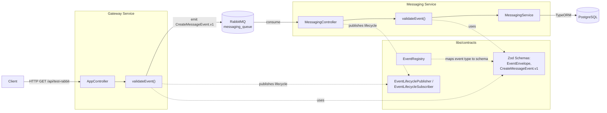
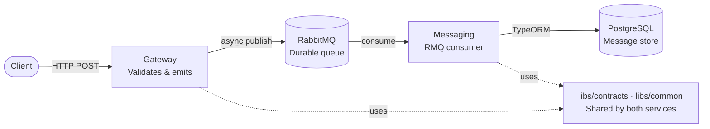

# Messaging Showcase

A distributed, event-driven backend built with NestJS, demonstrating contract-driven service communication over RabbitMQ, schema-enforced event validation, correlation tracing, and an integration test strategy that verifies cross-service behavior without polling a database for side effects.

This is a single, narrow vertical slice — one event type, two services — built to a standard of correctness and testability rather than feature breadth. It is intended as a reference for how a small event-driven system can be made deterministic and verifiable end to end.

## Architecture



Both the gateway and the messaging service depend on `libs/contracts` for schema definitions and validation, and on `libs/common` for structured logging and correlation ID propagation. Neither service depends on the other directly — they communicate exclusively through RabbitMQ, against a shared, versioned contract.

## Component Responsibilities

High-level data flow, from HTTP entry to database persistence:



### Client

The client is the HTTP entry point into the system. It sends a `POST` request to the Gateway with a JSON payload conforming to the event contract. From the client's perspective the interaction ends once it receives an HTTP response — it does not wait for the Messaging service to consume or persist anything. Everything after the Gateway's publish to RabbitMQ is asynchronous and invisible to the caller. There is no retry or acknowledgement mechanism visible at this boundary; if the Messaging service fails to process the event, the client receives no signal — traceability at that point is log-based only, via the correlation ID.

### Gateway

The Gateway is the only public-facing service. It receives HTTP requests, validates the incoming payload against the Zod schema in `libs/contracts`, attaches a correlation ID via `CorrelationIdMiddleware`, wraps the payload in an event envelope, and publishes it to RabbitMQ. It does not persist anything — it has no database connection. If validation fails, it responds `400 Bad Request` with structured errors and never emits. If validation passes, it publishes to `messaging_queue` and responds immediately; it does not wait for the Messaging service to confirm receipt or processing. It depends on both `libs/contracts` (schema and validation) and `libs/common` (logging and correlation ID propagation).

### RabbitMQ

RabbitMQ is the async transport layer and the only channel through which the two services communicate. It holds a named durable queue (`messaging_queue`) backed by a direct exchange — durable meaning the queue survives a broker restart without losing unconsumed messages. A second exchange is used for event lifecycle tracing, but that is test-only and excluded from the production path. There is no dead-letter queue, no retry policy, and no competing consumers — failed or invalid messages are logged and dropped. The choice of RabbitMQ over Kafka was made to keep operational complexity low for a two-service system, at the cost of not demonstrating partitioned, high-throughput streaming patterns.

### Messaging

The Messaging service is the consumer and persistence layer. It listens on `messaging_queue`, re-validates each event against the same Zod schema the Gateway already applied, and persists the event to PostgreSQL if validation passes. The re-validation is deliberate: it protects against schema drift in cases where a future producer does not go through the Gateway's code path. If validation fails at this boundary, the event is logged and dropped — no requeue, no dead-letter routing. The service has no HTTP endpoints of its own and sends no response back to the Gateway or the client. Like the Gateway, it depends on both `libs/contracts` and `libs/common`.

### PostgreSQL

PostgreSQL is the single persistence point in the system. Only the Messaging service writes to it. Each row represents an event that successfully passed both validation hops (Gateway and Messaging). Correlation IDs are not stored — they travel through the event envelope and appear in logs but the schema does not include a column for them, keeping the persistence model simple. Invalid or failed events never reach a write. The database schema reflects the validated payload shape defined in `libs/contracts`, not a raw or unprocessed form.

### Shared libraries

**`libs/contracts`** is the event contract registry. It defines the Zod schemas for event payloads and envelopes, the versioned `EventRegistry` that maps event-type strings to their schemas, the validation helper (`validateEvent`), and the event builder. Both services import from this single source, which structurally prevents them from diverging on what a valid event looks like. The infrastructure supports multiple versioned event types, but the sample registers only one (`CreateMessageEvent.v1`) to keep the codebase focused.

**`libs/common`** provides shared infrastructure utilities: a configured Winston logger used consistently across both services, and the correlation ID middleware and propagation logic. It handles attaching and reading correlation IDs as they travel through the system but deliberately stops short of persisting them — that boundary (propagate but do not store) is a conscious design decision. The two libraries are kept separate because their reasons to change are independent: the event schema evolves when the contract changes; the logging and correlation infrastructure evolves independently of that.

## Key Engineering Concepts

**Contract-driven events.** Every event exchanged between services is defined as a Zod schema in `libs/contracts`, not as an ad hoc object literal passed to `client.emit()`. The producer and the consumer each validate independently against the same schema — an event is never assumed to be well-formed just because it came from a known queue.

**Schema validation.** Validation is fail-fast and non-throwing at the API level: `validateEvent()` returns a discriminated `{ valid: true, event } | { valid: false, errors }` result rather than throwing, so callers decide what "fail fast" means in their context — the gateway responds `400` with structured errors and never emits; the messaging service logs a structured rejection and drops the message without retry.

**Event registry.** `EventRegistry` maps a versioned event-type string (`'CreateMessageEvent.v1'`) to its schema. This is the single place a new event type or version is registered, rather than a string literal repeated at every `emit()` and `@MessagePattern()` call site.

**Correlation IDs.** `CorrelationIdMiddleware` assigns a UUID to every inbound HTTP request. That same ID is carried as a required, UUID-typed field on the event envelope itself, so it propagates across the RabbitMQ boundary as part of the contract, not as an informal convention — an event with a missing or malformed correlation ID fails schema validation before it is ever emitted.

**Structured logging.** Every log statement that touches a request or event includes the correlation ID, via a shared Winston-based logger in `libs/common`. Logs are JSON-formatted in production and human-readable in development.

**Event lifecycle tracing.** Separately from production logging, an opt-in mechanism (`EVENT_LIFECYCLE_TRACING=true`, enabled only in the test environment) publishes a small record to a dedicated RabbitMQ exchange every time an event reaches one of five stages: `emitted`, `received`, `validated`, `rejected`, `persisted`. This exists purely so the integration test can observe real system behavior as it happens.

**Integration testing without polling.** The integration test does not query PostgreSQL in a retry loop to infer whether processing finished. It subscribes to the lifecycle exchange above and awaits the exact moment a specific event, identified by its `eventId`, reaches each stage — resolving immediately on arrival rather than on a fixed interval, and failing with a clear timeout error if a stage never occurs. A single, non-polling database read at the end confirms the resulting row, after the lifecycle signal has already established that the write happened.

## Technology Stack

| Layer | Technology |
|---|---|
| Runtime | Node.js 22 |
| Framework | NestJS 11 (monorepo mode) |
| Messaging | RabbitMQ 3 (`@nestjs/microservices` RMQ transport, `amqplib`) |
| Database | PostgreSQL 15 |
| ORM / Migrations | TypeORM 0.3 |
| Schema validation | Zod 4 |
| Logging | Winston 3, with daily file rotation |
| Language | TypeScript 5.7 |
| Containerization | Docker, Docker Compose |
| CI | GitHub Actions |
| Testing | Jest 30, Supertest |

## Event Flow

The system currently implements one end-to-end flow, triggered by `GET /api/test-rabbit`:

1. The client sends an HTTP request to the gateway. `CorrelationIdMiddleware` assigns a correlation ID if the caller did not supply one.
2. `AppController` builds a `CreateMessageEvent.v1` (envelope plus payload) via `buildCreateMessageEventV1`, populating `eventId`, `timestamp`, `source: 'gateway'`, and `trace: ['gateway']`.
3. The gateway validates the event against its own schema before doing anything else. An invalid event (for example, a non-UUID correlation ID) is never emitted: the gateway responds `400 Bad Request` with structured validation errors and publishes a `rejected` lifecycle record.
4. On success, the gateway calls `client.emit('CreateMessageEvent.v1', event)` against the RabbitMQ client, publishes an `emitted` lifecycle record, and returns `{ status, correlationId, eventId, eventType }` to the caller immediately — emission is fire-and-forget; the gateway does not wait for the messaging service.
5. RabbitMQ delivers the message to the durable `messaging_queue`.
6. `MessagingController` receives the message and validates it again, independently of the gateway's validation, against the same schema. An invalid payload is logged as a structured rejection and dropped — the RMQ transport runs with `noAck: true`, so there is nothing to acknowledge or requeue.
7. On success, the messaging service publishes `received` and `validated` lifecycle records, appends `'messaging'` to the event's `trace`, and calls `MessagingService.handleMessageCreation` with the validated payload.
8. The payload is persisted as a `Message` row via TypeORM. A `persisted` lifecycle record is published once the write completes.

## Contracts

Event contracts live in `libs/contracts` and are built on [Zod](https://zod.dev). Every event extends a shared envelope:

```ts
export const eventEnvelopeSchema = z.object({
  eventId: z.uuid(),
  correlationId: z.uuid(),
  timestamp: z.iso.datetime(),
  source: serviceIdSchema,       // 'gateway' | 'messaging'
  trace: z.array(serviceIdSchema).min(1),
});
```

`trace` is a lightweight model: the producer initializes it to `[source]`, and the consumer appends its own ID once it has validated the event. There are no spans and no parent/child relationships — it answers one question cheaply ("which services has this event passed through") rather than functioning as a general tracing system.

A versioned event extends the envelope with a literal `type` discriminator and a payload schema:

```ts
export const createMessageEventV1Schema = eventEnvelopeSchema.extend({
  type: z.literal('CreateMessageEvent.v1'),
  payload: createMessageEventV1PayloadSchema,
});
```

`EventRegistry` maps the type string to the schema:

```ts
export const EventRegistry = {
  'CreateMessageEvent.v1': createMessageEventV1Schema,
} as const;
```

**Versioning strategy.** A breaking change to a payload shape is introduced as a new registry entry (`'CreateMessageEvent.v2'`), not a mutation of the existing v1 schema. Existing producers and consumers continue working against v1 unchanged until they are migrated. There is no automatic migration or dual-write tooling — nothing in this codebase currently requires it — but the registry's keying scheme is what makes adding a v2 straightforward: a new schema file, a new registry entry, and a second `@MessagePattern` handler for as long as both versions need to coexist. A dedicated backward-compatibility test (`libs/contracts/src/events/v1/create-message.compat.spec.ts`) validates a frozen, hand-written v1 event fixture against the current schema on every run, so an accidental breaking change to v1 is caught immediately rather than discovered downstream.

**Validation process.** `validateEvent(eventType, raw)` looks up the schema for `eventType` in the registry and calls `schema.safeParse(raw)`. It never throws; it returns either `{ valid: true, event }` with a fully-typed event, or `{ valid: false, errors }` with a structured list of `{ path, message }` failures, suitable for logging directly.

A real event, exactly as produced by `buildCreateMessageEventV1`:

```json
{
  "type": "CreateMessageEvent.v1",
  "eventId": "ef005129-9374-498e-9b34-8ad67a99a0aa",
  "correlationId": "8c2e3a4b-5d6f-4a1b-9c3d-2e4f5a6b7c8d",
  "timestamp": "2026-06-17T23:07:34.189Z",
  "source": "gateway",
  "trace": ["gateway"],
  "payload": {
    "subject": "System test message",
    "content": "Hello RabbitMQ!"
  }
}
```

## Testing Strategy

| Layer | What it verifies | Infrastructure required |
|---|---|---|
| Contract | Event schemas validate correctly; a frozen v1 fixture still validates against the current schema (breaking-change detection) | None |
| Unit | Controllers and services in isolation, with RabbitMQ clients, repositories, and the lifecycle publisher mocked | None |
| E2E (module bootstrap) | `AppModule` wires together correctly (providers, controllers, middleware); does not exercise RabbitMQ or PostgreSQL | None |
| Integration | The full path — gateway, RabbitMQ, messaging service, PostgreSQL — against real infrastructure, with no mocks | Docker Compose |

The integration test does not assert correctness by polling the `messages` table. It connects to the same RabbitMQ broker the real services use, subscribes to the lifecycle exchange, and awaits the `emitted` → `received` → `validated` → `persisted` sequence for one specific `eventId`, asserting the correlation ID is identical at every hop. Only after the chain is confirmed does it issue a single, non-polling read against PostgreSQL to confirm the resulting row. A second test sends a request with an invalid correlation ID and asserts a `400` response plus a `rejected` lifecycle record, with no downstream record created.

| Command | Layer |
|---|---|
| `npm run test:contracts` | Contract tests |
| `npm run test` | Unit tests |
| `npm run test:e2e` | E2E (module bootstrap) test |
| `npm run test:integration` | Full-stack integration test (brings up Docker Compose, runs the test, tears it down) |

## Running Locally

### Prerequisites

- Node.js 22+
- Docker and Docker Compose

### With Docker Compose

```bash
cp .env.example .env
docker-compose up --build
```

This starts PostgreSQL, RabbitMQ, pgAdmin, an Nginx reverse proxy, and both NestJS applications in watch mode, all on the `showcase-network` bridge network.

Access points once running:

| Service | URL |
|---|---|
| Application, via Nginx | `http://localhost:8080/api` |
| Gateway, direct | `http://localhost:3005/api` |
| RabbitMQ management UI | `http://localhost:15672` |
| pgAdmin | `http://localhost:5050` |

### Without Docker

```bash
npm install
npm run migration:run
npm run start:dev:gateway     # terminal 1
npm run start:dev:messaging   # terminal 2
```

This requires PostgreSQL and RabbitMQ to already be reachable at whatever `DB_HOST`/`RABBITMQ_URL` your environment exports — see `.env.example` for the full set of variables consumed by each service.

### Build

```bash
npm run build              # gateway
npx nest build messaging   # messaging service
```

## CI Pipeline

`.github/workflows/ci.yml` runs two sequential jobs on every push and pull request.

**Build and unit test job** — no external infrastructure:

1. Install dependencies (`npm ci`).
2. Contract tests (`npm run test:contracts`) — fastest possible signal, runs first.
3. Lint (`npm run lint`).
4. Build both applications (`npm run build`, `npx nest build messaging`) — this is also where TypeScript type errors surface, since the build step compiles the entire project; there is no separate type-check command.
5. Unit tests (`npm run test -- --ci`).
6. E2E module bootstrap test (`npm run test:e2e -- --ci`).

**Integration test job** — runs only if the first job succeeds:

1. Bring up `docker-compose.test.yml` (`npm run test:integration:up`).
2. Poll `docker-compose ps` until every container reports healthy, rather than relying solely on a fixed sleep, so the job fails fast with a clear reason if a container never becomes ready.
3. Run the integration test (`npm run test:integration:run`).
4. On failure, upload container logs from the stack as a workflow artifact.
5. Tear the stack down unconditionally (`npm run test:integration:down`).

Both jobs have explicit timeouts so a hung container or test cannot block the workflow indefinitely.

## Repository Structure

```
apps/
  gateway/             HTTP entrypoint. Validates and emits CreateMessageEvent.v1.
    src/
    test/              E2E module bootstrap test.
  messaging/           RabbitMQ consumer. Validates and persists events.
    src/
      entities/        TypeORM entity (Message).
      messages/        Separate CRUD module (REST-style, over RabbitMQ
                        message patterns), not yet wired to the gateway
                        or the contract system.
      migrations/

libs/
  common/              Structured logging (Winston) and correlation ID
                       middleware, shared by both apps.
  contracts/
    src/
      events/          Envelope schema, CreateMessageEvent.v1, the event
                       registry, the validation helper, the event builder.
      lifecycle/       Event lifecycle publisher/subscriber (test-only).

test/
  integration/         Full-stack integration test.
  utils/               EventTracker (lifecycle subscriber wrapper) and
                       infrastructure readiness helpers.

docs/
  architecture.md      Service boundaries, contracts, event flow, design
                       rationale, known limitations.
  observability.md     Logging strategy, correlation ID lifecycle,
                       debugging workflow.
  testing.md           Full breakdown of every test layer and the CI
                       pipeline.

docker-compose.yml       Dev stack.
docker-compose.test.yml  Isolated stack for the integration test, used
                         identically in CI and locally.
Dockerfile               Single image, used by both apps and by the test
                         stack's build.
```

## Design Decisions

**Why RabbitMQ.** The gateway and the messaging service communicate asynchronously rather than via direct HTTP calls, for two reasons: the gateway can accept and queue a request even if the messaging service is temporarily unavailable, since RabbitMQ holds durable messages on a durable queue until a consumer connects; and the two services can be deployed and restarted independently, since they only need to agree on a message contract, not on each other's network location at call time. The tradeoff is that the gateway's HTTP response confirms the event was published, not that it was persisted — `emit()` does not wait for a reply.

**Why contracts.** Before the contract system existed, events were bare object literals passed to `client.emit('createMessage', { ...whatever })`, with no enforcement that the producer and consumer agreed on a shape. A typo or a dropped field would only surface as a runtime failure on the consumer side, with no clear signal of where the mismatch was introduced. A shared, versioned schema, validated independently on both ends, turns that into a fail-fast, logged rejection at the boundary where the mismatch actually occurs.

**Why correlation IDs.** A single client request fans out across an HTTP request, a RabbitMQ message, and a database write, each logged independently by a different process. Without a correlation ID carried through every hop, reconstructing what happened for one specific request means correlating logs by approximate timestamp. Making the correlation ID a required, schema-validated field — rather than an optional, conventionally-included one — means it cannot silently disappear partway through the chain.

**Why schema validation.** Validating once, at the producer, would still leave the consumer trusting that whatever arrived on the queue matches what was sent — true today, but not guaranteed if a future producer (or a manually-published test message) does not go through the same code path. Validating independently on both ends costs very little and removes that assumption entirely.

**Why integration tests without database polling.** A polling loop against the database can only answer "did a matching row eventually appear" — it cannot say the row came from this specific request, that contract validation happened on both ends, or what order things occurred in. Publishing a lifecycle record at the moment each step actually happens turns "wait an arbitrary amount of time and check" into "wait for the specific thing that already happened," which is both faster in the common case and more precise about what it is actually asserting.

## Limitations

This is a deliberately narrow showcase, not a production system. Specifically:

- **No authentication or authorization.** Every endpoint is open. There is no concept of a calling user or service identity — `Message.sender` is hardcoded to `'system-user'` in `MessagingService`, not derived from any caller context.
- **Single event type.** Only `CreateMessageEvent.v1` exists. The registry and versioning scheme are designed to support more, but nothing else is registered.
- **One fixed trigger endpoint.** `GET /api/test-rabbit` sends a hardcoded subject and content; there is no general-purpose HTTP endpoint that accepts arbitrary input and routes it through the contract system. A separate `messages` CRUD module exists in the messaging service (create, list, get, update, delete, over RabbitMQ message patterns) but is not wired to the gateway and is not part of `EventRegistry`.
- **No correlation ID column.** The `Message` entity does not store the correlation ID that produced it. Cross-service correlation is verified via logs and, in the integration test, via the lifecycle exchange — not via a queryable column on the persisted row.
- **Event lifecycle tracing is test-only.** It is gated behind `EVENT_LIFECYCLE_TRACING=true`, set only in `.env.test`, and lifecycle records are not persisted anywhere — they exist only for as long as a subscriber is connected to observe them. It is not a production observability system.
- **No retry or dead-letter handling.** The RabbitMQ consumer runs with `noAck: true`; an invalid or failed message is logged and dropped, not requeued or routed to a dead-letter queue.
- **No horizontal scaling story.** Both services run as a single instance each, in both the dev and test Docker Compose stacks. Nothing prevents running multiple consumers against the same queue, but it has not been exercised or tested here.
- **Test and dev Docker Compose stacks share host ports.** `docker-compose.test.yml` intentionally binds the same host ports as `docker-compose.yml`, so the two cannot run simultaneously on one machine — see the header comment in `docker-compose.test.yml`.

## Future Improvements

- A second registered event type, to exercise the versioning and registry design beyond a single case.
- A general-purpose, input-accepting HTTP endpoint routed through the contract system, rather than a single fixed test trigger.
- A correlation ID column on persisted entities, so cross-service correlation can be queried directly rather than only observed through logs or the test-only lifecycle exchange.
- Dead-letter queue handling for messages that fail validation or processing after delivery.

## Tradeoffs

- **RabbitMQ over Kafka.** Chosen to keep operational complexity low for a two-service system, at the cost of not demonstrating partitioned, high-throughput streaming patterns.
- **Correlation IDs are not persisted.** They propagate through the event envelope and logs but are not stored in PostgreSQL, keeping the persistence model simple while limiting traceability to log-based inspection.
- **Event lifecycle tracing is test-only.** It exists solely to make integration tests deterministic and is intentionally excluded from the production execution path.
- **Validation happens independently at each service boundary.** Both producer and consumer validate the contract, reducing the risk of schema drift at the cost of additional validation work per hop.
- **Single-event contract registry.** The infrastructure supports versioned contracts, but the sample application intentionally demonstrates a single event type to keep the codebase focused and easy to review.
- **No retry or dead-letter strategy.** Failed or invalid events are logged and dropped. This keeps the example concise while leaving room for future DLQ and retry policies.
- **Shared host ports for development and integration environments.** Reduces configuration complexity but prevents running both Docker stacks simultaneously on the same machine.

## What This Project Demonstrates

This repository is intended to demonstrate the following, narrowly and verifiably, rather than broad feature coverage:

- **Distributed systems fundamentals**: asynchronous, queue-based communication between independently deployable services, with explicit handling of the fact that a producer cannot assume a consumer is available at the moment of sending.
- **Event-driven architecture with enforced contracts**: a shared schema as the actual interface between services, validated on both ends, rather than an implicit agreement maintained by convention.
- **Service boundaries**: each service owns its own responsibilities and, in the messaging service's case, its own database access — the gateway has no database connection at all.
- **A testing strategy suited to distributed behavior**: contract tests that catch breaking changes before they reach a consumer, and an integration test that verifies a multi-hop, asynchronous flow deterministically, without depending on arbitrary wait times or inferring success from a side effect.
- **CI/CD practice**: a pipeline that separates fast, infrastructure-free checks from a full-stack integration run, fails fast on the cheapest possible signal, and captures diagnostic logs on failure rather than only a pass/fail result.
