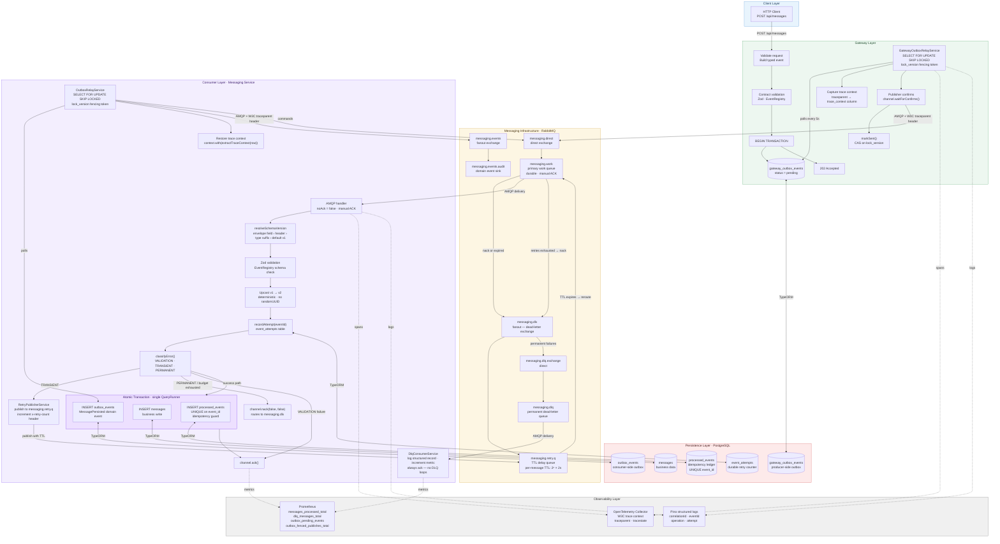

```mermaid
flowchart TD
    subgraph CLIENT["Client Layer"]
        USER["HTTP Client\nPOST /api/messages"]
    end

    subgraph GATEWAY["Gateway Layer"]
        direction TB
        GW_VALIDATE["Validate request\nBuild typed event"]
        GW_CONTRACT["Contract validation\nZod · EventRegistry"]
        GW_TX["BEGIN TRANSACTION"]
        GW_OUTBOX[("gateway_outbox_events\nstatus = pending")]
        GW_RESPONSE["202 Accepted"]
        GW_RELAY["GatewayOutboxRelayService\nSELECT FOR UPDATE SKIP LOCKED\nlock_version fencing token"]
        GW_CONFIRMS["Publisher confirms\nchannel.waitForConfirms()"]
        GW_MARK["markSent()\nCAS on lock_version"]
        GW_TRACE_CAP["Capture trace context\ntraceparent → trace_context column"]

        GW_VALIDATE --> GW_CONTRACT --> GW_TX --> GW_OUTBOX
        GW_TX --> GW_RESPONSE
        GW_RELAY -->|"polls every 5s"| GW_OUTBOX
        GW_RELAY --> GW_TRACE_CAP
        GW_RELAY --> GW_CONFIRMS --> GW_MARK
    end

    subgraph BROKER["Messaging Infrastructure · RabbitMQ"]
        direction TB
        EX_DIRECT["messaging.direct\ndirect exchange"]
        EX_EVENTS["messaging.events\nfanout exchange"]
        EX_DLX["messaging.dlx\nfanout — dead-letter exchange"]
        EX_DLQEX["messaging.dlq.exchange\ndirect"]

        Q_WORK["messaging.work\nprimary work queue\ndurable · manual ACK"]
        Q_RETRY["messaging.retry.q\nTTL delay queue\nper-message TTL: 2ⁿ × 2s"]
        Q_DLQ["messaging.dlq\npermanent dead-letter queue"]
        Q_AUDIT["messaging.events.audit\ndomain event sink"]

        EX_DIRECT --> Q_WORK
        EX_EVENTS --> Q_AUDIT
        Q_WORK -->|"nack or expired"| EX_DLX
        EX_DLX --> Q_RETRY
        Q_RETRY -->|"TTL expires → reroute"| Q_WORK
        EX_DLQEX --> Q_DLQ
    end

    subgraph CONSUMER["Consumer Layer · Messaging Service"]
        direction TB
        C_AMQP["AMQP handler\nnoAck = false · manual ACK"]
        C_VERSION["resolveSchemaVersion\nenvelope field › header › type suffix › default v1"]
        C_VALIDATE["Zod validation\nEventRegistry schema check"]
        C_UPCAST["Upcast v1 → v2\ndeterministic · no randomUUID"]
        C_ATTEMPTS["recordAttempt(eventId)\nevent_attempts table"]
        C_CLASSIFY["classifyError()\nVALIDATION · TRANSIENT · PERMANENT"]

        subgraph C_TX["Atomic Transaction · single QueryRunner"]
            C_IDEMP["INSERT processed_events\nUNIQUE on event_id\nidempotency guard"]
            C_BIZ["INSERT messages\nbusiness write"]
            C_OUTBOX_ROW["INSERT outbox_events\nMessagePersisted domain event"]
        end

        C_ACK["channel.ack()"]
        C_RETRY_PUB["RetryPublisherService\npublish to messaging.retry.q\nincrement x-retry-count header"]
        C_NACK_FINAL["channel.nack(false, false)\nroutes to messaging.dlx"]
        C_RELAY_OUT["OutboxRelayService\nSELECT FOR UPDATE SKIP LOCKED\nlock_version fencing token"]
        C_TRACE_RESTORE["Restore trace context\ncontext.with(extractTraceContext(row))"]
        DLQ_CONSUMER["DlqConsumerService\nlog structured record · increment metric\nalways ack — no DLQ loops"]

        C_AMQP --> C_VERSION --> C_VALIDATE --> C_UPCAST
        C_UPCAST --> C_ATTEMPTS --> C_CLASSIFY
        C_CLASSIFY -->|"TRANSIENT"| C_RETRY_PUB
        C_CLASSIFY -->|"PERMANENT / budget exhausted"| C_NACK_FINAL
        C_CLASSIFY -->|"VALIDATION failure"| C_ACK
        C_CLASSIFY -->|"success path"| C_TX
        C_TX --> C_ACK
        C_RELAY_OUT -->|"polls"| C_OUTBOX_ROW
        C_RELAY_OUT --> C_TRACE_RESTORE
    end

    subgraph PERSISTENCE["Persistence Layer · PostgreSQL"]
        direction LR
        DB_GOB[("gateway_outbox_events\nproducer-side outbox")]
        DB_PROC[("processed_events\nidempotency ledger\nUNIQUE event_id")]
        DB_MSG[("messages\nbusiness data")]
        DB_OB[("outbox_events\nconsumer-side outbox")]
        DB_ATT[("event_attempts\ndurable retry counter")]
    end

    subgraph OBSERVABILITY["Observability Layer"]
        direction LR
        OTEL["OpenTelemetry Collector\nW3C trace context\ntraceparent · tracestate"]
        PROM["Prometheus\nmessages_processed_total\ndlq_messages_total\noutbox_pending_events\noutbox_fenced_publishes_total"]
        LOGS["Pino structured logs\ncorrelationId · eventId\noperation · attempt"]
    end

    USER -->|"POST /api/messages"| GW_VALIDATE
    GW_OUTBOX <-->|"TypeORM"| DB_GOB
    GW_CONFIRMS -->|"AMQP + W3C traceparent header"| EX_DIRECT
    Q_WORK -->|"AMQP delivery"| C_AMQP
    C_IDEMP <-->|"TypeORM"| DB_PROC
    C_BIZ <-->|"TypeORM"| DB_MSG
    C_OUTBOX_ROW <-->|"TypeORM"| DB_OB
    C_ATTEMPTS <-->|"TypeORM"| DB_ATT
    C_RETRY_PUB -->|"publish with TTL"| Q_RETRY
    Q_DLQ -->|"AMQP delivery"| DLQ_CONSUMER
    C_RELAY_OUT -->|"AMQP + W3C traceparent header"| EX_EVENTS
    C_RELAY_OUT -->|"commands"| EX_DIRECT
    Q_WORK -->|"retries exhausted → nack"| EX_DLX
    EX_DLX -->|"permanent failures"| EX_DLQEX

    GW_RELAY -.->|"spans"| OTEL
    C_AMQP -.->|"spans"| OTEL
    C_ACK -.->|"metrics"| PROM
    DLQ_CONSUMER -.->|"metrics"| PROM
    C_AMQP -.->|"logs"| LOGS
    GW_RELAY -.->|"logs"| LOGS

    style CLIENT fill:#e8f4fd,stroke:#5b9bd5,color:#1a3a5c
    style GATEWAY fill:#edf7f0,stroke:#5aaa72,color:#1a4a2a
    style BROKER fill:#fdf6e3,stroke:#d4a843,color:#4a3510
    style CONSUMER fill:#f3eefe,stroke:#8b5cf6,color:#3b1a6e
    style PERSISTENCE fill:#fdeaea,stroke:#d45a5a,color:#4a1a1a
    style OBSERVABILITY fill:#f0f0f0,stroke:#888,color:#333
    style C_TX fill:#ede0ff,stroke:#7c3aed,color:#3b1a6e
```
